**GitLab与Jenkins结合构建持续集成(CI)环境**

一．持续集成概述及gitlab介绍
----------------------------

### 1.持续集成概述及运行流程：

持续集成概述：持续集成（Continuous
integration）持续集成是指开发者在代码的开发过程中，可以频繁的将代码部署集成到主干，并进程自动化测试。

持续交付：持续交付指的是在持续集成的环境基础之上，将代码部署到预生产环境。

持续部署：在持续交付的基础上，把部署到生产环境的过程自动化。

### 2.GitHub和GitLab的区别：

相同点:
二者都是基于web的Git仓库，在很大程度上GitLab是仿照GitHub来做的，它们都提供了分享开源项目的平台，为开发团队提供了存储、分享、发布和合作开发项目的中心化云存储的场所。

不同点：

1、GitHub如果要使用私有仓库，是需要付费的。GitLab可以在上面创建私人的免费仓库。

2、GitLab让开发团队对他们的代码仓库拥有更多的控制，相比于GitHub，它有不少的特色：允许免费设置仓库权限；允许用户选择分享一个project的部分代码；允许用户设置project的获取权限，进一步的提升安全性；可以设置获取到团队整体的改进进度；通过innersourcing让不在权限范围内的人访问不到该资源。

总结：从代码私有性方面来看，有时公司并不希望员工获取到全部的代码，这个时候GitLab无疑是更好的选择。但对于开源项目而言，GitHub依然是代码托管的首选。

github 是一个基于git实现的在线代码托管仓库，包含一个网站界面，向互联网开放

gitlab
是一个基于git实现的在线代码仓库托管软件，一般用于在企业内部网络搭建git私服

注： gitlab-ce 社区版 ； gitlab-ee是企业版，收费

### 3.持续集成系统的工作流程大概分为以下几步

1, 开发者将新版本push到Gitlab。

2, Gitlab随后触发jenkins master结点进行一次build。(通过web hook或者定时检测)

3, jenkins
master结点将这个build任务分配给若干个注册的slave结点中的一个，这个slave结点根据一个事先设置好的脚本进行build。这个脚本可以做的事情很多，比如编译，测试，生成测试报告等等。这些原本需要手动完成的任务都可以交给jenkins来做。

4, 我们在build中要进行编译，这里使用了分布式编译器distcc来加快编译速度。

二．搭建GitLab平台
------------------

实验环境： centos7.4 虚拟机需要6G，不然后期运行时，内存不够用，直接报错。

### 安装Gitlab需要的组件

yum install curl policycoreutils openssh-server openssh-clients postfix -y

默认，使用 Postfix 发送邮件

systemctl start postfix;systemctl enable postfix

iptables –F

systemctl stop firewalld;systemctl disable firewalld

### 安装GitLab

方法一：使用清华源yum安装

[root\@lewis63 yum.repos.d]\# cat gitlab_gitlab-ce.repo

[gitlab-ce]

name=gitlab-ce

baseurl=http://mirrors.tuna.tsinghua.edu.cn/gitlab-ce/yum/el7

repo_gpgcheck=0

gpgcheck=0

enabled=1

gpgkey=https://packages.gitlab.com/gpg.key

[root\@lewis63 \~]\# yum install gitlab-ce –y

方法二：本地上rpm包安装

[root\@lewis63 \~]\# rpm -ivh gitlab-ce-10.2.3-ce.0.el7.x86_64.rpm

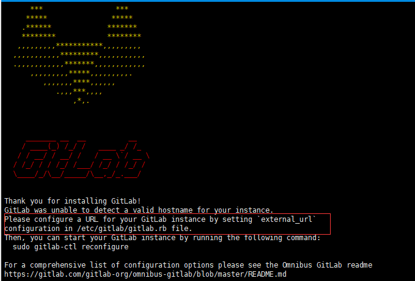

安装完成有提示让配置gitlab访问地址：

[root\@lewis63 \~]\# vim /etc/gitlab/gitlab.rb

external_url 'http://192.168.1.63' \#修改成自己IP地址

**重新配置应用程序**

gitlab-ctl reconfigure
\#重新配置应用程序。修改了gitlab服务配置文件后，都需要执行一下这个命令。让各个服务的配置文件，重新加载一下配置文件。

[root\@lewis63 \~]\# gitlab-ctl status
\#可以使用gitlab-ctl管理gitlab，例如**查看gitlab状态**：

run: gitaly: (pid 3404) 79s; run: log: (pid 3106) 126s

run: gitlab-monitor: (pid 3420) 78s; run: log: (pid 3169) 114s

run: gitlab-workhorse: (pid 3392) 80s; run: log: (pid 3062) 139s

run: logrotate: (pid 3090) 132s; run: log: (pid 3089) 132s

run: nginx: (pid 3069) 138s; run: log: (pid 3068) 138s

run: node-exporter: (pid 3154) 120s; run: log: (pid 3153) 120s

run: postgres-exporter: (pid 3446) 77s; run: log: (pid 3317) 96s

run: postgresql: (pid 2841) 198s; run: log: (pid 2840) 198s

run: prometheus: (pid 3436) 78s; run: log: (pid 3249) 102s

run: redis: (pid 2781) 209s; run: log: (pid 2780) 209s

run: redis-exporter: (pid 3222) 108s; run: log: (pid 3221) 108s

run: sidekiq: (pid 3045) 146s; run: log: (pid 3044) 146s

run: unicorn: (pid 3007) 152s; run: log: (pid 3006) 152s

[root\@lewis63 \~]\# netstat -anput \| grep 80

tcp 0 0 127.0.0.1:8080 0.0.0.0:\* LISTEN 3040/unicorn master

tcp 0 0 0.0.0.0:80 0.0.0.0:\* LISTEN 3069/nginx: master

tcp 0 0 0.0.0.0:8060 0.0.0.0:\* LISTEN 3069/nginx: master

**默认使用nginx做为web界面**

**注：如果后期web界面访问时，总报502，要把防火墙清空规则，另外内存要大于4G，不然后内存不足，也报502**

### 登录GitLab

第一次登录gitlab，需要为root用户修改密码，root用户也是gitlab的超级管理员

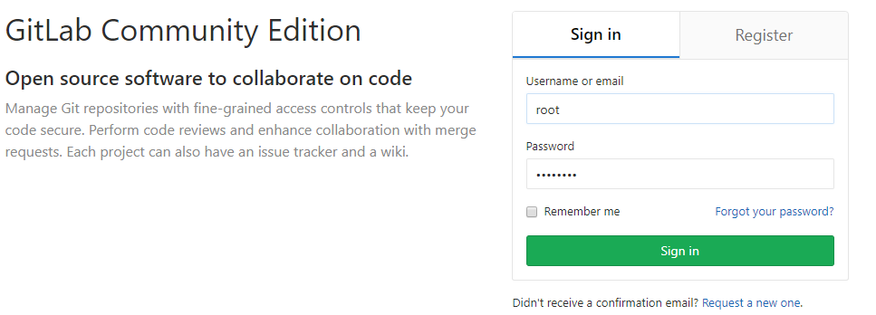

关闭GitLab注册功能：

默认情况下可以直接注册账号，不需要注册功能，可以关闭。

点Admin area -》 setting -》 取消sign-up enabled标签前对勾

### 管理GitLab

关闭gitlab： \# gitlab-ctl stop

启动gitlab： \# gitlab-ctl start

重启gitlab： \# gitlab-ctl restart

gitlab主配置文件：/etc/gitlab/gitlab.rb //可以自定义一些邮件服务等

日志地址：/var/log/gitlab/ // 对应各服务

服务地址：/var/opt/gitlab/ // 对应各服务的主目录

仓库地址：/var/opt/gitlab/git-data //记录项目仓库等提交信息

重置配置：gitlab-ctl reconfigure //不要乱用，会重置为最原始的配置

重启服务：gitlab-ctl stop/start/restart //启动命令

### centos7部署汉化版GitLab

获取gitlab汉化包

下载git：yum install -y git

克隆获取汉化版本库

下载最新的汉化包：

git clone <https://gitlab.com/xhang/gitlab.git>

如果下载老版本的汉化包，需要加上老版本的分支：

[root\@lewis63 \~]\# git clone https://gitlab.com/xhang/gitlab.git -b v10.2.3-zh

查看该汉化补丁的版本

cat gitlab/VERSION

gitlab-ctl stop \#停止gitlab服务

cd /root/gitlab \#切换到gitlab汉化包所在的目录

**比较汉化标签和原标签，导出 patch 用的 diff 文件到/root下**

git diff v10.2.3 v10.2.3-zh \> ../10.2.3-zh.diff

yum install patch -y

cd \#回到root

将10.2.3-zh.diff作为补丁更新到gitlab中

patch -d /opt/gitlab/embedded/service/gitlab-rails -p1 \< 10.2.3-zh.diff

启动服务，**等1分钟，再去访问web页面。访问太快会显示502错误。**

gitlab-ctl start

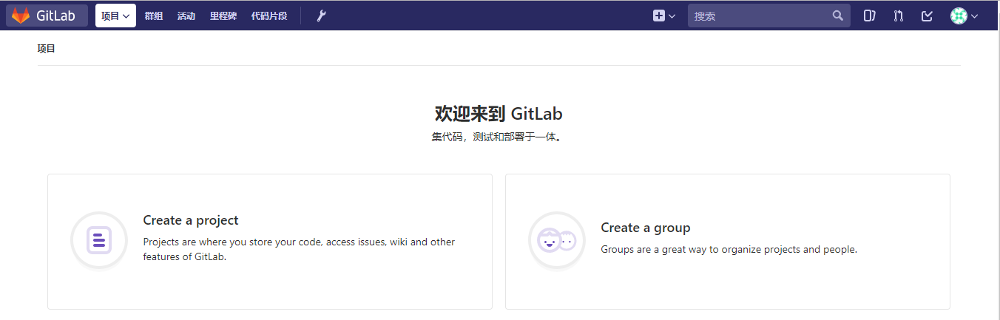

三．GitLab日常使用
------------------

### 1.新建项目

先创建群组

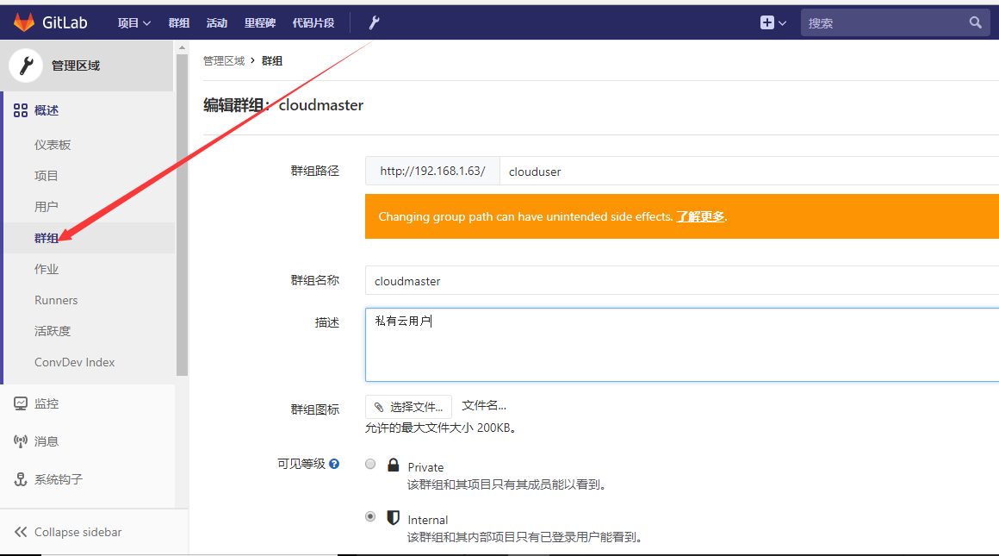

创建项目

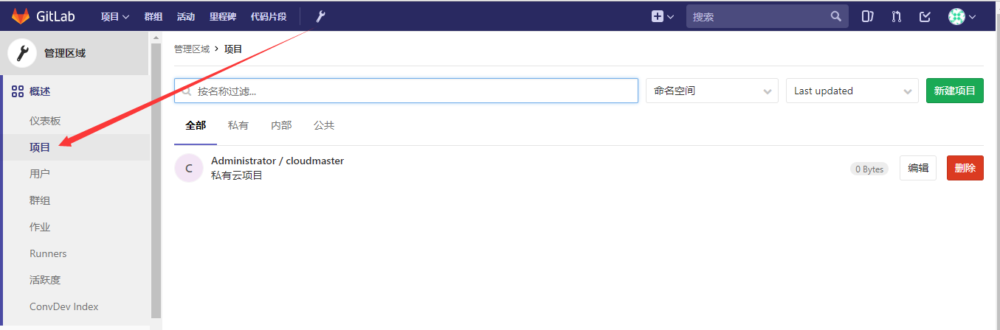

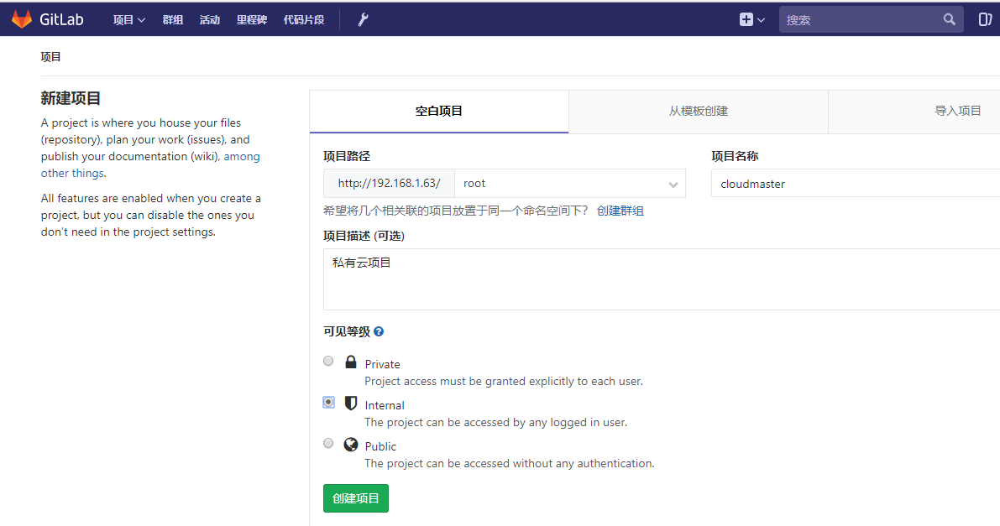

可见等级：

1.  Private：私有的，只有自己或者组内成员可以访问

2.  Internet：所有登录gitlab平台的用户都可以访问

3.  Public：公开的，所有人都可以访问，即不登录gitlab也可以访问

### 2.创建用户

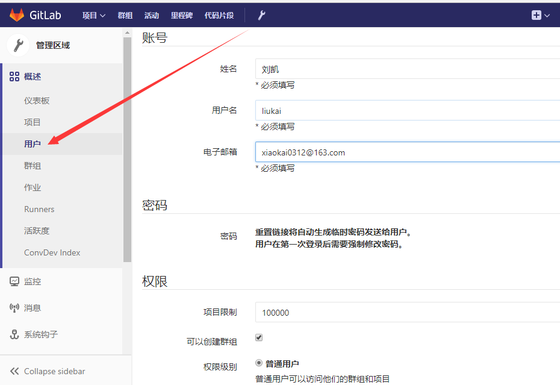

### 3.重置用户密码

方法1.登录邮箱

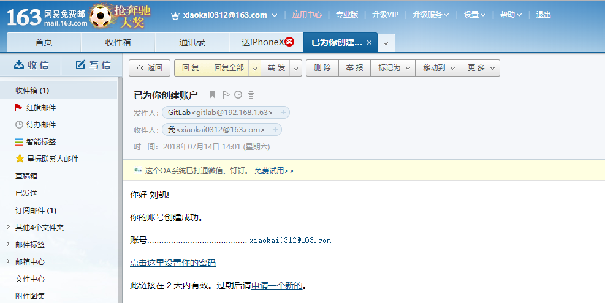

方法2.修改密码

选择Admin area -》用户-》选中用户-》编辑

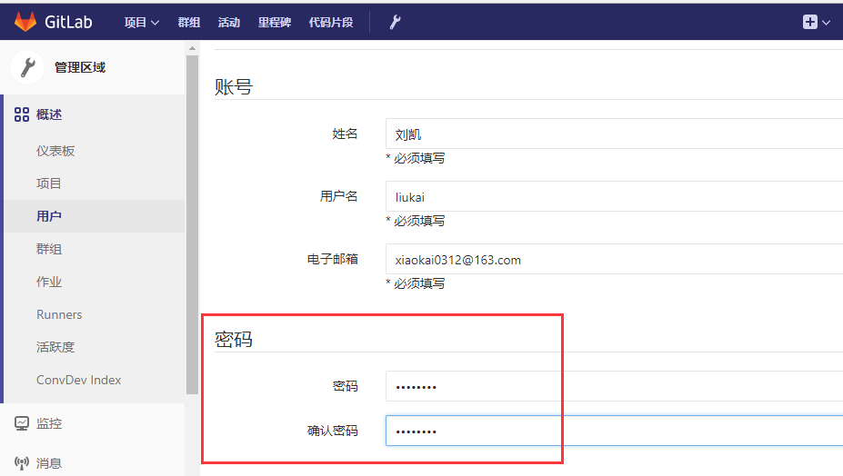

### 4.删除用户

当对方离职时候，为了安全起见，需要删除对方的gitlab权限，避免机密信息丢失，操作方法如下：

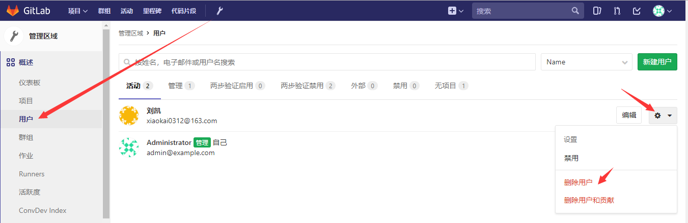

### 5.添加用户到群组

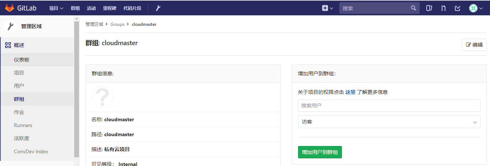

### 6.添加代码

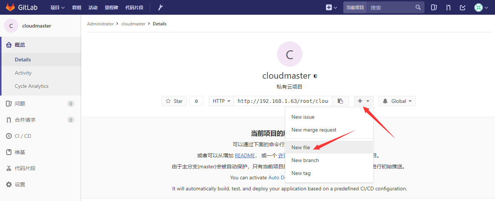

### 导出克隆项目

安装git

yum install git -y

下载项目

[root\@lewis63 \~]\# git clone
[git\@192.168.1.63:root/cloudmaster.git](git@192.168.1.63:root/cloudmaster.git)

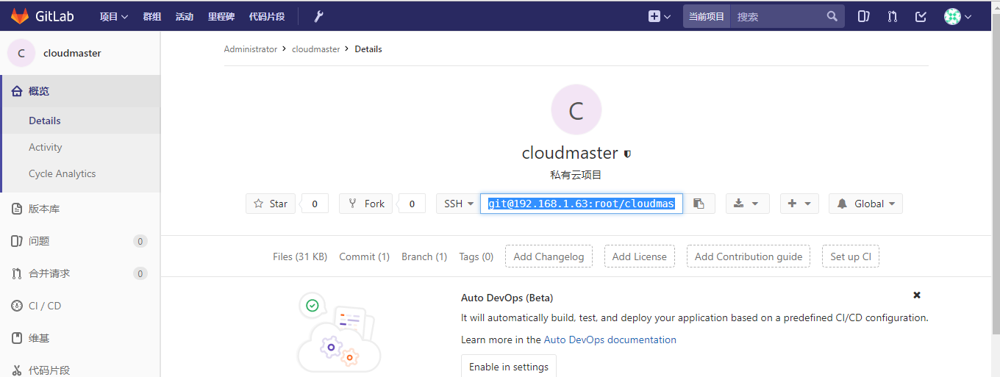

也可以使用http协议下载

[root\@lewis63 \~]\# git clone <http://192.168.1.63/root/cloudmaster.git>

Cloning into 'cloudmaster'...

Username for 'http://192.168.1.63': liukai

Password for 'http://liukai\@192.168.1.63':密码

查看克隆下来的代码

[root\@lewis63 \~]\# ls cloudmaster/ -a

. .. .git index.html

### 8.初次运行Git前配置

一般在新的系统上，我们都需要先配置下自己的 Git
工作环境。配置工作只需一次，以后升级时还会沿用现在的配置。

第一个要配置的是你个人的用户名称和电子邮件地址。这两条配置很重要，每次 Git
提交时都会引用这两条信息，说明是谁提交了更新，所以会随更新内容一起被永久纳入历史记录。

git运行的环境变量有点像.bashrc，决定了 Git
在各个环节的具体工作方式和行为。这些变量可以存放在以下两个的地方：

1、\~/.gitconfig 文件：用户目录下的配置文件只适用于该用户。若使用 git config
时用 --global 选项，读写的就是这个文件。

例子：修改用户信息

[root\@lewis63 \~]\# git config --global user.name "liukai"

[root\@lewis63 \~]\# git config --global user.email "xiaokai0312\@163.com"

[root\@lewis63 \~]\# cat \~/.gitconfig

[user]

name = liukai

email = <xiaokai0312@163.com>

2、当前项目的 Git 目录中的配置文件（也就是工作目录中的 .git/config
文件）：这里的配置仅仅针对当前项目有效。每一个级别的配置都会覆盖上层的相同配置，所以
.git/config 里的配置会覆盖 \~/.gitconfig中的同名变量。

如果要在某个特定的项目中使用其他名字或者邮件地址，先进到项目上下，然后只要去掉
--global 选项重新配置即可。 最后配置的用户和邮件地址会保存在当前项目的
.git/config 文件里。

例：修改某个git项目下的环境变量

[root\@lewis63 \~]\# cd cloudmaster/

[root\@lewis63 cloudmaster]\# git config user.name "liukai"

[root\@lewis63 cloudmaster]\# git config user.email "xiaokai0312\@163.com"

[root\@lewis63 cloudmaster]\# cat ./.git/config

[core]

repositoryformatversion = 0

filemode = true

bare = false

logallrefupdates = true

[remote "origin"]

url = http://192.168.1.63/root/cloudmaster.git

fetch = +refs/heads/\*:refs/remotes/origin/\*

[branch "master"]

remote = origin

merge = refs/heads/master

[user]

name = liukai

email = <xiaokai0312@163.com>

### 9.Git常用命令

git config --global user.name “name“ \#设置全局用户名

git config --global user.email mail \#设置全局邮箱

git config --global --list \#列出用户全局设置

git add index.html \#添加文件到暂存区

git commit -m “描述内容“ \#提交文件到工作区

git status \#查看工作区的状态

git push \#提交代码到git服务器上

git pull \#获取代码到本地

git log \#查看操作日志

vim .gitignore \#定义忽略文件

git reset --hard HEAD\^ \#git版本回滚，
HEAD为当前版本，加一个\^为上一个，\^\^为上上一个版本

git reflog \# \#获取每次提交的ID，可以使用--hard根据提交的ID进行版本回退

git reset --hard 5ae4b06 \#回退到指定id的版本

\# git branch \#查看当前所处的分支

git checkout -- file \#从服务器更新某个那文件覆盖本地的文件

例：把修改过的index.html文件更新主版本中

[root\@lewis63 cloudmaster]\# echo "hello,world" \> index.html

[root\@lewis63 cloudmaster]\# git add index.html

[root\@lewis63 cloudmaster]\# git commit -m "edit index" **\#提交到暂存区中**

[master de8e096] edit index

1 file changed, 1 insertion(+), 1 deletion(-)

[root\@lewis63 cloudmaster]\# git push -u origin master **\#上传到主干master上**

Username for 'http://192.168.1.63': liukai

Password for 'http://liukai\@192.168.1.63':

remote: GitLab: You are not allowed to push code to protected branches on this
project.

提示没有权限提交代码到master

解决：

版本库-》保护分支-》允许push选择开发

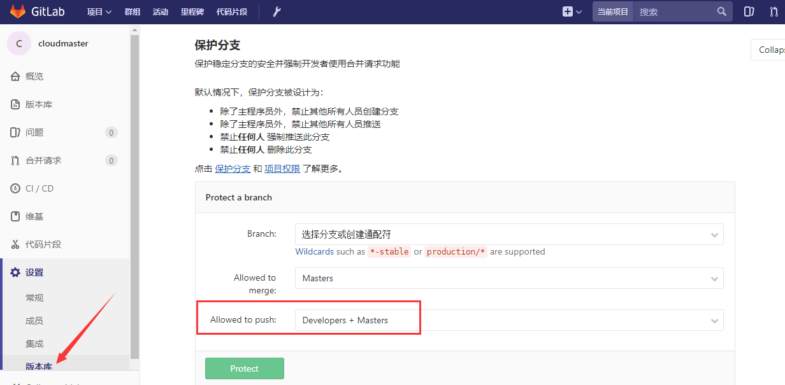

### 10.工作区和暂存区及分支

1、工作区就是编辑文件的目录区域，需要将工作区的修改好的文件add到暂存区才能提交到git服务器，在工作区有多个文件的时候可以将一个或多个文件添加至暂存区，再提交到git服务器即可。

2、在服务器创建分支

[root\@lewis63 cloudmaster]\# git branch bbs **\#创建一个分支**

[root\@lewis63 cloudmaster]\# git checkout bbs **\#切换到分支bbs**

Switched to branch 'bbs'

[root\@lewis63 cloudmaster]\# git branch **\#查看当前所处的分支**

\* bbs

master

[root\@lewis63 cloudmaster]\# echo "bbs branch" \> a.txt
**\#随意在里面写一些内容**

[root\@lewis63 cloudmaster]\# git add a.txt

[root\@lewis63 cloudmaster]\# git commit -m "提交到bbs分支" **\#提交到暂存区中**

[bbs 0ee53ea] 提交到bbs分支

1 file changed, 1 insertion(+)

create mode 100644 a.txt

[root\@lewis63 cloudmaster]\# git push -u origin bbs **\#上传到分支bbs分支上**

### 11.部署密钥

项目-》设置-》版本库

[root\@lewis63 \~]\# ssh-keygen \#生成公钥

[root\@lewis63 \~]\# cat .ssh/id_rsa.pub

ssh-rsa
AAAAB3NzaC1yc2EAAAADAQABAAABAQDjpJQYgBrwR2WpaR4sr9ENrmrTrSurVcgA0NVuqLHm4HOLrRX9yp+YZGz/65E8vGDRnlgSmUq9CzioCS/dmAHLy7vEZGDh4kz2EbR22p2VfsPJ08bBTdW3ZZ43flqFj/MN3+mnzUWt1PL2CG/VU+eukr5zAjKfXlI3ZQnfG8sp8VxK57+IjEVg4mEOGEbrZrvQjGxuUvf2m8ffgGyWGvzPlc/w5yMG2LtOYXoqPfZ2hWBq8c2ISEhLmDRGUA3fxMUKR62MeYAMa4eVwxeK5dYLVcZBQqLwzLmCD3l/33GNfyPZKvtocor66ma1Qg/KkUbz2CRtMJgrO0l5e2ZnqUT5
root\@lewis63

把密钥粘贴到gitlab密钥，允许推送，添加密钥

部署key后，可以不用用户密码直接获取代码

### 12.关于git push.default设置的知识。

默认配置下，当使用git
push命令而没有明确的指名本地分支和远程参考分支的情况下，会有如上的提示。如果git
push命令没有明确指定引用规格(refspec),也就是没有指定推送的源分支和目标分支，那么git会采用push.default定义的动作。不同的值适用于不同的工作流程模式。

显而易见，主要是因为之前没有进行设置引用规格才出现的这种问题，现在我把push.default的可用值与配置方法贴在下面。push.default可用的值如下：

1.nothing
不推送任何东西并有错误提示，除非明确指定分支引用规格。强制使用分支引用规格来避免可能潜在的错误。

2.current 推送当前分支到接收端名字相同的分支。

3.upstream
推送当前分支到上游\@{upstream}。这个模式只适用于推送到与拉取数据相同的仓库，比如中央工作仓库流程模式。

4.simple
在中央仓库工作流程模式下，拒绝推送到上游与本地分支名字不同的分支。也就是只有本地分支名和上游分支名字一致才可以推送，
就算是推送到不是拉取数据的远程仓库，只要名字相同也是可以的。在GIT
2.0中，simple将会是push.default的默认值。 simple只会推送本地当前分支。

5.matching 推送本地仓库和远程仓库所有名字相同的分支。这是git当前版本的缺省值。

配置push.default的命令如下： git config --global push.default simple

四．搭建Jenkins实现持续集成
---------------------------

### 1.源码安装JDK1.8

Jenkins是Java编写的，所以需要先安装JDK，这里采用yum安装，如果对版本有需求，可以直接在Oracle官网下载JDK。

[root\@lewis63 \~]\# tar -zxf jdk-8u161-linux-x64.tar.gz -C /usr/local/

[root\@lewis63 \~]\# cd /usr/local/

[root\@lewis63 local]\# mv jdk1.8.0_161 jdk

配置环境变量

[root\@lewis63 local]\# vim /etc/profile \#在末尾加入

export JAVA_HOME=/usr/local/jdk

export JRE_HOME=/usr/local/jdk/jre

export
CLASSPATH=.:\$JAVA_HOME/lib/dt.jar:\$JAVA_HOME/lib/tools.jar:\$JRE_HOME/lib

export PATH=\$JAVA_HOME/bin:\$JRE_HOME/bin:\$PATH

[root\@lewis63 local]\# source /etc/profile \#使立即生效

[root\@lewis63 local]\# java -version

java version "1.8.0_161"

Java(TM) SE Runtime Environment (build 1.8.0_161-b12)

Java HotSpot(TM) 64-Bit Server VM (build 25.161-b12, mixed mode)

### 2.安装jenkins

[root\@lewis63 \~]\# wget [http://pkg.jenkins.io/redhat/jenkins.repo -O
/etc/yum.repos.d/jenkins.repo](http://pkg.jenkins.io/redhat/jenkins.repo%20-O%20/etc/yum.repos.d/jenkins.repo)

[root\@lewis63 yum.repos.d]\# rpm --import
<http://pkg.jenkins.io/redhat/jenkins.io.key>

[root\@lewis63 yum.repos.d]\# yum install -y jenkins
\#默认安装最新版本。或者直接安装jenkins-2.93-1.1.noarch.rpm包

**注：新版GitLab的服务端口为8080，为了不和GitLab的服务端口相冲突，修改Jenkins的默认端口8080为198**

[root\@lewis63 \~]\# vim /etc/sysconfig/jenkins

改：56 JENKINS_PORT="8080"

为：56 JENKINS_PORT="1198"

10 JENKINS_HOME="/var/lib/jenkins"
\#数据目录，建议用固态磁盘来存数据，可以自己定义

[root\@lewis63 \~]\# /etc/init.d/jenkins start

报错1：

systemctl status jenkins.service

**Starting Jenkins bash: /usr/bin/java: No such file or directory**

**发现是找不到jdk，修改文件**

**解决：**

**ln -s /usr/local/jdk/bin/java /usr/bin/java \#做链接**

**报错2：**

**启动jenkins发现端口没有起来，查看jenkins日志**

**tail /var/log/jenkins/jenkins.log 权限不够**

**jenkins默认是以jenkins用户运行，修改jenkins用户为root**

**[root\@lewis63 \~]\# vim /etc/sysconfig/jenkins**

**JENKINS_USER="root"**

重新启动：

[root\@lewis63 \~]\# /etc/init.d/jenkins start

[root\@lewis63 bin]\# netstat -anput \| grep 1198

tcp6 0 0 :::1198 :::\* LISTEN 24112/java

[root\@lewis63 \~]\# chkconfig jenkins on

浏览器访问<http://192.168.1.63:1198>

安装推荐的插件

### 3.手动安装jenkins插件

如果在下线安装插件失败了，或是无网环境下想安装插件，可以选择手动安装

安装成功后，登录系统，选择：

系统管理-\>插件管理-\>高级

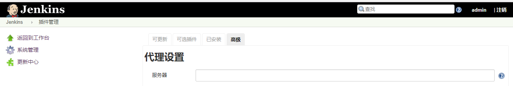

插件下载地址：

http://updates.jenkins-ci.org/download/plugins/
\#在有网的环境下，把自己需要的插件下载好，然后再从本地上传。

方法2：
也可以直接把一台安装好jenkins插件服务器的/var/lib/jenkins/plugins目录下的文件复制到新的jenkins中。

把准备好的插件解压一下：

[root\@lewis63 jenkins]\# tar czvf plugins.tar.gz plugins/

\#cd /var/lib/jenkins/

\#rm -rf /var/lib/jenkins/plugins

\#tar -zxvf plugins.tar.gz \#上传plugins.tar.gz到linux系统上，解压缩

\#chown jenkins.jenkins ./\* -R

\#/etc/init.d/jenkins start

注：记得重启jenkins，这个非常重要，因为不重启，插件不会生效

到此jenkins安装成功。

登录gitlab http://192.168.1.63/ 用户名： root

登录jenkins http://192.168.1.63:198/ 用户名： admin
