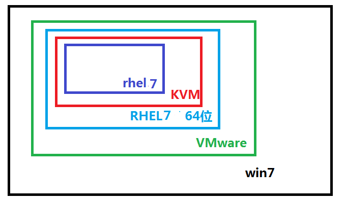
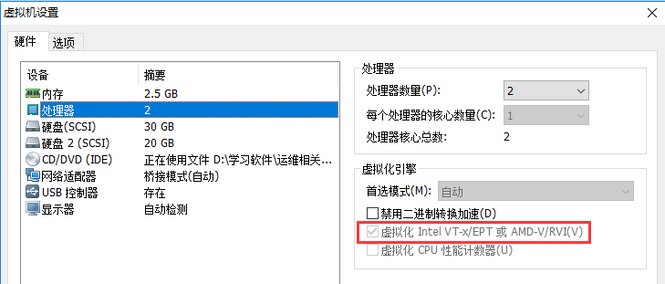
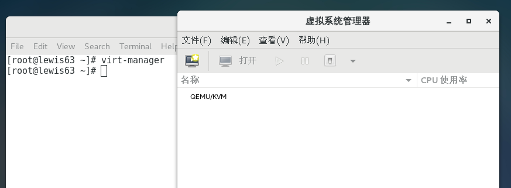
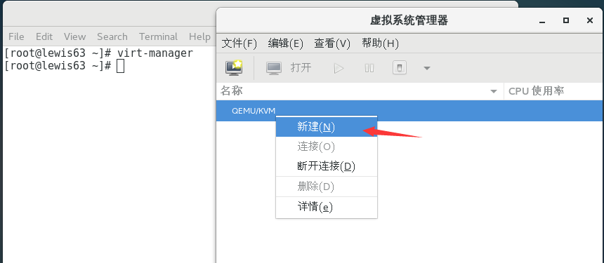
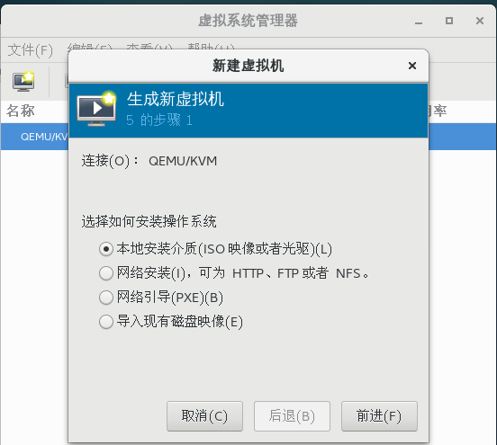

KVM虚拟化
=========

一．虚拟化产品介绍
------------------

虚拟化技术：

仿真虚拟化：对系统硬件没有要求,性能最低]

半虚拟化：虚拟机可以使用真机物理硬件，性能高，需要改内核]
只能虚拟和载体同一操作系统

全虚拟化：直接使用物理硬件，性能高

vmware 支持仿真虚拟化

xen 半虚拟化 REHL5自带xen, 安装时需要安装内核 rpm -ivh kernel-xen-xxx.rpm

kvm 全虚拟化 RHEL6 自带kvm

KVM概述：

KVM 即Kernel-based Virtual Machine 基于内核的虚拟机。Qumranet, 依赖于 Intel
VT-x， AMD AMD-v **KVM是基于内核的虚拟化技术**

KVM，是一个开源的系统虚拟化模块，自Linux
2.6.20之后集成在Linux的各个主要发行版本中。它使用Linux自身的调度器进行管理，所以相对于Xen，其核心源码很少。KVM目前已成为学术界的主流VMM(虚拟机监控器)之一。KVM的虚拟化需要硬件支持（如Intel
VT技术或者AMD
V技术)。是基于硬件的完全虚拟化。而Xen早期则是基于软件模拟的Para-Virtualization。

KVM： 是指基于 Linux 内核的虚拟机(Kernel-based Virtual Machine)。是第一个整合到
Linux 内核的虚拟化技术。在 KVM 模型中，每一个虚拟机都是一个由 Linux
调度程序管理的标准进程，可以在用户空间启动客户机操作系统。**KVM支持linux以外的其它系统。比如:windows**

一个普通的 Linux 进程有两种运行模式：内核和用户。 KVM
增加了第三种模式：客户模式(有自己的内核和用户模式)

**XEN ：需要升级内核，只能支持和物理机系统一样的操作系统。**

QEMU：是一套由Fabrice
Bellard所编写的以GPL许可证分发源码的模拟处理器，在GNU/Linux平台上使用广泛。QEMU具有高速度和跨平台的特性，QEMU能模拟至接近真实电脑的速度。

QEMU能模拟整个电脑系统，包括中央处理器及其他周边设备。

QEMU和vmware一样都是支持仿真虚拟化，效率比较低。

二．配置KVM 前期准备工作 
-------------------------

KVM实验拓扑图

(1)虚拟机内存调成2G以上，要在VMware虚拟中安装KVM,然后在KVM中再安装虚拟机

(2)添加一个20G的硬盘，用于存KVM虚拟机

(3)开启BIOS虚拟化支持

**注： 只有64位RHEL6以上系统支持KVM。 32位系统不支持。**

查看cpu是否支持虚拟化

Intel：cat /proc/cpuinfo \| grep --color vmx

AMD :cat /proc/cpuinfo \| grep --color svm

看看flag有没有上面的vmx或者是svm，有的话就是支持全虚拟化技术

如果看不到ｖｍｘ，是因为 VMware CPU没有开启 VT 技术

安装KVM
-------

2.1安装KVM模块、管理工具和libvirt
---------------------------------

先配置本地yum源

[root\@lewis63 \~]\# cat /etc/yum.repos.d/Centos-Base.repo

[base]

name=CentOS7

baseurl=file:///mnt

enabled=1

gpgcheck=0

yum install qemu-kvm libvirt libguestfs-tools virt-install virt-manager
libvirt-python –y

说明：

qemu-kvm ： kvm主程序， KVM虚拟化模块

virt-manager： KVM图形化管理工具

libvirt： 虚拟化服务

libguestfs-tools : 虚拟机的系统管理工具

virt-install ： 安装虚拟机的实用工具 。比如 virt-clone克隆工具就是这个包安装的

libvirt-python ： python调用libvirt虚拟化服务的api接口库文件

2.2启动服务
-----------

systemctl start libvirtd;systemctl enable libvirtd

[root\@lewis63 \~]\# systemctl is-enabled libvirtd \#查看是不是开机启动

enabled

确定正确加载kvm 模块，检查 KVM 模块是否成功安装

[root\@lewis63 \~]\# lsmod \| grep kvm

kvm_intel 170086 0

kvm 566340 1 kvm_intel

irqbypass 13503 1 kvm

2.3使用virt-manager 命令建立虚拟机
----------------------------------

将kvm管理工具从英文界面，切换成中文界面

LANG='zh_CN.UTF-8'

执行virt-manager后，弹出如下界面：

配置KVM网络桥接功能
-------------------

网桥介绍:
我们经常所说的Bridge设备其实就是网桥设备，也就相当于现在的二层交换机，用于连接同一网段内的所有机器，所以我们的目的就是将网络设备ens33添加到br0，此时br0就成为了所谓的交换机设备，我们物理机的eth0也是连接在上面的。

添加桥接设备br0： 相当于一个二层交换机，目的是让kvm虚拟机通过ens33可以连接外网

安装桥设备工具

rpm -ivh /mnt/Packages/bridge-utils-1.5-9.el7.x86_64.rpm

把etns33绑到br0桥设备上

[root\@lewis63 \~]\# cd /etc/sysconfig/network-scripts/

[root\@lewis63 network-scripts]\# cp ifcfg-ens33 ifcfg-ens33.bak

[root\@lewis63 network-scripts]\# vim ifcfg-ens33

TYPE="Ethernet"

BOOTPROTO="none"

NAME="ens33"

DEVICE="ens33"

ONBOOT="yes"

BRIDGE="br0"

**生成桥设备的配置文件**

[root\@lewis63 network-scripts]\# vim ifcfg-br0

DEVICE="br0"

NM_CONTROLLED="yes"

ONBOOT="yes"

TYPE="Bridge"

BOOTPROTO=none

IPADDR=192.168.1.63

NETMASK=255.255.255.0

GATEWAY=192.168.1.254

DNS1=225.5.5.5

**注：TYPE="Bridge"　 B大写**

systemctl restart network

查看桥接的信息

[root\@lewis63 network-scripts]\# brctl show

bridge name bridge id STP enabled interfaces

br0 8000.000c290eebb0 no ens33

virbr0 8000.5254001de1ba yes virbr0-nic

新建KVM虚拟机
-------------

### 4.1创建一个分区，用于存放安装好的Linux操作系统

fdisk /dev/sdb

fdisk /dev/sdb

。。。

[root\@lewis63 \~]\# lsblk /dev/sdb

NAME MAJ:MIN RM SIZE RO TYPE MOUNTPOINT

sdb 8:16 0 20G 0 disk

└─sdb1 8:17 0 20G 0 part

mkfs.xfs /dev/sdb1 \#格式化

mount /dev/sdb1 /var/lib/libvirt/images/ **\#安装虚拟机，默认存放的路径**

注：准备系统镜像：把centos7.4镜像上传到/var/lib/libvirt/images/目录下

dd if=/dev/sr0 of=//var/lib/libvirt/images/Centos7.iso

[root\@lewis63 \~]\# virt-manage \#在linux图形化界面操作

KVM虚拟机常用命令
-----------------

[root\@lewis63 \~]\# virsh list \#列出在运行的虚拟机

[root\@lewis63 \~]\# virsh start centos7.0 \#启动centos7.0虚拟机

[root\@lewis63 \~]\# virsh shutdown centos7.0 \#关闭centos7.0虚拟机

[root\@lewis63 \~]\# virsh autostart centos7.0
\#设置centos7.0虚拟机为物理机开机后，自动启动

测试：

reboot后，没有发现kvm虚拟机开机自动启动。

解决：

chkconfig --list libvirtd \#开机启动了

libvirtd 0:off 1:off 2:off 3:on 4:on 5:on 6:off

**\#设置开机自动挂载sdb1，否则开机启动不了虚拟机**

[root\@lewis63 \~]\# echo "/dev/sdb1 /var/lib/libvirt/images xfs default 0 0"
\>\> /etc/fstab
