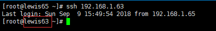
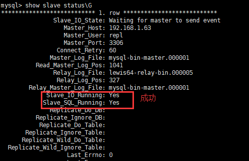
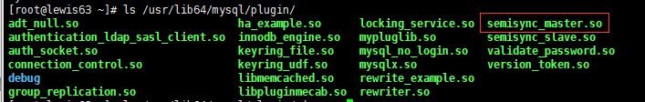
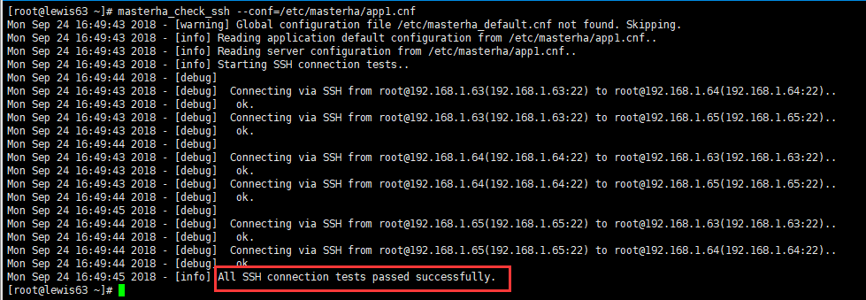
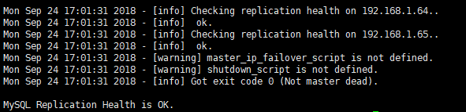
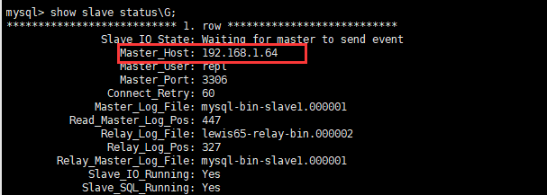

MySQL高可用之MHA
================

MHA简介
-------

### 1.MHA介绍

MHA（Master High
Availability）目前在MySQL高可用方面是一个相对成熟的解决方案，它由日本DeNA公司youshimaton（现就职于Facebook公司）开发，是一套优秀的作为MySQL高可用性环境下故障切换和主从提升的高可用软件。在MySQL故障切换过程中，MHA能做到在0\~30秒之内自动完成数据库的故障切换操作，并且在进行故障切换的过程中，MHA能在最大程度上保证数据的一致性，以达到真正意义上的高可用。

该软件由两部分组成：MHA Manager（管理节点）和MHA Node（数据节点）。MHA
Manager可以单独部署在一台独立的机器上管理多个master-slave集群，也可以部署在一台slave节点上。MHA
Node运行在每台MySQL服务器上，MHA
Manager会定时探测集群中的master节点，当master出现故障时，它可以自动将最新数据的slave提升为新的master，然后将所有其他的slave重新指向新的master。整个故障转移过程对应用程序完全透明。

在MHA自动故障切换过程中，MHA试图从宕机的主服务器上保存二进制日志，最大程度的保证数据的不丢失，但这并不总是可行的。例如，如果主服务器硬件故障或无法通过ssh访问，MHA没法保存二进制日志，只进行故障转移而丢失了最新的数据。使用MySQL
5.5的半同步复制，可以大大降低数据丢失的风险。MHA可以与半同步复制结合起来。如果只有一个slave已经收到了最新的二进制日志，MHA可以将最新的二进制日志应用于其他所有的slave服务器上，因此可以保证所有节点的数据一致性。

目前MHA主要支持一主多从的架构，要搭建MHA,要求一个复制集群中必须最少有三台数据库服务器，一主二从，即一台充当master，一台充当备用master，另外一台充当从库，因为至少需要三台服务器，出于机器成本的考虑，淘宝也在该基础上进行了改造，目前淘宝TMHA已经支持一主一从。

### 2.MHA工作原理

（1）从宕机崩溃的master保存二进制日志事件（binlog events）;

（2）识别含有最新更新的slave；

（3）应用差异的中继日志（relay log）到其他的slave；

（4）应用从master保存的二进制日志事件（binlog events）；

（5）提升一个slave为新的master；

（6）使其他的slave连接新的master进行复制；

### 3.MHA软件组成

MHA软件由两部分组成，Manager工具包和Node工具包，具体的说明如下。

Manager工具包主要包括以下几个工具：

masterha_check_ssh 检查MHA的SSH配置状况

masterha_check_repl 检查MySQL复制状况

masterha_manger 启动MHA

masterha_check_status 检测当前MHA运行状态

masterha_master_monitor 检测master是否宕机

masterha_master_switch 控制故障转移（自动或者手动）

masterha_conf_host 添加或删除配置的server信息

Node工具包（这些工具通常由MHA
Manager的脚本触发，无需人为操作）主要包括以下几个工具：

save_binary_logs 保存和复制master的二进制日志

apply_diff_relay_logs 识别差异的中继日志事件并将其差异的事件应用于其他的slave

filter_mysqlbinlog 去除不必要的ROLLBACK事件（MHA已不再使用这个工具）

purge_relay_logs 清除中继日志（不会阻塞SQL线程）

MySql半同步复制
---------------

### 2.1复制的分类及区别

异步复制：MySQL复制默认是异步复制。主库将事务Binlog事件写入到Binlog文件中，此时主库只会通知一下Dump线程发送这些新的Binlog，但并不知道Slave是否或何时已经接收且已处理。然后主库就会继续处理提交操作，而此时不会保证这些Binlog传到任何一个从库节点上。在异步复制的机制的情况下，如果Master宕机，事务在Master上已提交，但很可能这些事务没有传到任何的Slave上，此时Slave也可能会丢失事务

全同步复制：MySQL在5.7.17中引入了一个全新的技术。当主库提交事务之后，所有的从库节点必须收到，APPLY并且提交这些事务，然后主库线程才能继续做后续操作。这里面有一个很明显的缺点就是，主库完成一个事务的时间被拉长，性能降低。

半同步复制：介于全同步复制和异步复制之间的一种。主库只需要等待至少一个从库节点收到并且Flush
Binlog到Relay
Log文件即可，主库不需要等待所有从库给主库反馈。同时，这里只是一个收到的反馈，而不是已经完全执行并且提交的反馈，这样就节省了很多时间。一定程度上保证提交的事务已经传给了至少一个备库。

实验拓扑
--------

具体搭建环境（使用操作系统为Centos7.4）：

| 主机名  | IP           | 角色                    | 软件                              |
|---------|--------------|-------------------------|-----------------------------------|
| lewis63 | 192.168.1.63 | manager,Master          | mha4mysql-manager、mha4mysql-node |
| lewis64 | 192.168.1.64 | Slave1,Candicate master | mha4mysql-node keepalived         |
| lewis65 | 192.168.1.65 | slave2                  | mha4mysql-node keepalived         |

其中master对外提供写服务，备选Candicate
master（实际为slave1）提供读服务，slave2也提供读服务，一旦master宕机，将会把备选master提升为新的master，slave指向新的master。三台服务器都安装mysql5.7

前提准备（三台机器）
--------------------

### 4.1配置hosts

cat /etc/hosts

192.168.1.63 lewis63

192.168.1.64 lewis64

192.168.1.65 lewis65

### 4.2配置ssh免密码登录

配置所有主机相互SSH登录无密码验证（使用key登录，工作中常用）。

注意：不能禁止 password 登陆，否则会出现错误

[root\@lewis63 \~]\# ssh-keygen 一路回车

。。。

[root\@lewis63 \~]\# ssh-copy-id 192.168.1.63

[root\@lewis63 \~]\# ssh-copy-id 192.168.1.64

[root\@lewis63 \~]\# ssh-copy-id 192.168.1.65

其他主机重复上面操作

测试：

在任意一台ssh到另外机器

搭建主从复制环境
----------------

### 5.1配置主数据库服务器

在lewis63创建需要同步的数据库

[root\@lewis63 \~]\# mysql -uroot -p

mysql\> create database HA;

mysql\> use HA;

mysql\> create table test(id int,name varchar(20));

[root\@lewis63 \~]\# vim /etc/my.cnf

log-bin=mysql-bin-master

server-id=1

binlog-do-db=HA

binlog-ignore-db=mysql

[root\@lewis63 \~]\# systemctl restart mysqld \#重启mysql

授权：

mysql\> grant replication slave on \*.\* to repl\@'192.168.1.%' identified by
'123456';

mysql\> flush privileges;

mysql\> show master status;

\+-------------------------+----------+--------------+------------------+-------------------+

\| File \| Position \| Binlog_Do_DB \| Binlog_Ignore_DB \| Executed_Gtid_Set \|

\+-------------------------+----------+--------------+------------------+-------------------+

\| mysql-bin-master.000001 \| 599 \| HA \| mysql \| \|

\+-------------------------+----------+--------------+------------------+-------------------+

1 row in set (0.00 sec)

导出数据库到从数据库服务器

[root\@lewis63 \~]\# mysqldump -uroot -p123456 -B HA \> HA.sql

[root\@lewis63 \~]\# scp HA.sql 192.168.1.64:/root

[root\@lewis63 \~]\# scp HA.sql 192.168.1.65:/root

### 5.2配置lewis64数据库服务器

导入数据库：

mysql -uroot -p123456 \< HA.sql

配置my.cnf

[root\@lewis64 \~]\# vim /etc/my.cnf [mysqld]加入

…….

log-bin=mysql-bin-slave1

server-id=2

binlog-do-db=HA

binlog-ignore-db=mysql

log_slave_updates=1

[root\@lewis64 \~]\# systemctl restart mysqld

mysql\> grant replication slave on \*.\* to 'repl'\@'192.169.1.%' identified by
'123456';

mysql\> flush privileges;

建立主从关系：

mysql\> change master to
master_host='192.168.1.63',master_user='repl',master_password='123456',master_log_file='mysql-bin-master.000001',master_log_pos=599;

mysql\> start slave;

从服务器设置read_only:

**注意：两台slave服务器设置read_only（从库对外提供读服务，之所以没有写进配置文件，是因为slave随时会提升为master）**

[root\@lewis64 \~]\# mysql -uroot -p123456 -e 'set global read_only=1'

mysql\> start slave; \#启动slave

mysql\> show slave status\\G \#查看状态

### 5.3配置lewis65从数据库服务器

导入数据库：

mysql -uroot -p123456 \< HA.sql

配置my.cnf

[root\@lewis64 \~]\# vim /etc/my.cnf [mysqld]加入

…….

log-bin=mysql-bin-slave2

server-id=3

binlog-do-db=HA

binlog-ignore-db=mysql

log_slave_updates=1

[root\@lewis65 \~]\# systemctl restart mysqld

mysql\> grant replication slave on \*.\* to 'repl'\@'192.169.1.%' identified by
'123456';

mysql\> flush privileges;

建立主从关系：

mysql\> change master to
master_host='192.168.1.63',master_user='repl',master_password='123456',master_log_file='mysql-bin-master.000001',master_log_pos=599;

mysql\> start slave;

从服务器设置read_only:

**注意：两台slave服务器设置read_only（从库对外提供读服务，之所以没有写进配置文件，是因为slave随时会提升为master）**

[root\@lewis65 \~]\# mysql -uroot -p123456 -e 'set global read_only=1'

mysql\> start slave; \#启动slave

mysql\> show slave status\\G \#查看状态

### 5.4在Master创建监控用户

mysql\> grant all privileges on \*.\* to 'root'\@'192.168.1.%' identified by
'123456';

mysql\> flush privileges;

MySQL5.7 半同步复制搭建
-----------------------

半同步复制的功能要在Master，Slave都开启，半同步复制才会起作用；否则，只开启一边，它依然为异步复制。

### 6.1 Master配置

在192.168.1.63配置：

安装半同步模块并启动(此模块位于/usr/local/mysql/lib/plugin/semisync_master.so)

mysql\> install plugin rpl_semi_sync_master soname 'semisync_master.so';

mysql\> show global variables like 'plugin_dir';

\+---------------+--------------------------+

\| Variable_name \| Value \|

\+---------------+--------------------------+

\| plugin_dir \| /usr/lib64/mysql/plugin/ \|

\+---------------+--------------------------+

查看是否启用：

rpl_semi_sync_master_wait_point \| AFTER_SYNC

5.7引入了无损复制（after_sync）模式，带来的主要收益是解决after_commit导致的master
crash后数据丢失问题，因此在引入after_sync模式后，所有提交的数据已经都被复制，故障切换时数据一致性将得到提升。

临时启用半同步：

mysql\> set global rpl_semi_sync_master_enabled = 1;

mysql\> set global rpl_semi_sync_master_timeout = 2000;

安装后启动和定制主从连接错误的超时时间默认是10s可改为2s，一旦有一次超时自动降级为异步

永久启用半同步复制：

[root\@lewis63 \~]\# vim /etc/my.cnf

[mysqld]

…

rpl_semi_sync_master_enabled=1

rpl_semi_sync_master_timeout=2000

扩展：

卸载模块：mysql\> uninstall plugin rpl_semi_sync_master;

### 6.2 Slave配置

192.168.1.64和192.168.1.65安装半同步模块并启动

mysql\> install plugin rpl_semi_sync_slave soname 'semisync_slave.so';

mysql\> set global rpl_semi_sync_slave_enabled = 1;

查看是否启用

mysql\> show global variables like '%semi%';

vim /etc/my.cnf

[mysqld]

……

rpl_semi_sync_slave_enabled=1

### 6.3从节点需要重新连接主服务器半同步才会生效

mysql\> stop slave io_thread;

mysql\> start slave io_thread;

### 6.4 Master节点查看是否启用半同步

主要看Rpl_semi_sync_master_clients是否不为0，Rpl_semi_sync_master_status是否为ON。如果Rpl_semi_sync_master_status为OFF，说明出现了网络延迟或Slave
IO线程延迟。

搭建MHA
-------

### 7.1安装MHA Node

所有节点安装mysql-community-libs-compat

rpm -ivh mysql-community-libs-compat-5.7.20-1.el7.x86_64.rpm

在所有节点安装MHA node所需的全部依赖

yum -y install perl-DBD-MySQL perl-Config-Tiny perl-Log-Dispatch
perl-Parallel-ForkManager --skip-broken

方法一：rpm包安装

上传MHA相关包，在所有的节点安装mha-node

rpm -ivh mha4mysql-node-0.53-0.el6.noarch.rpm

安装完成会在/usr/bin/目录下生成以下脚本文件：

[root\@lewis63 bin]\# ll app\* filter\* purge\* save\*

\-rwxr-xr-x 1 root root 15498 Jan 8 2012 apply_diff_relay_logs

\-rwxr-xr-x. 1 root root 46256 Jun 10 2014 filterdiff

\-rwxr-xr-x 1 root root 4807 Jan 8 2012 filter_mysqlbinlog

\-rwxr-xr-x 1 root root 7401 Jan 8 2012 purge_relay_logs

\-rwxr-xr-x 1 root root 7263 Jan 8 2012 save_binary_logs

方法二：源码安装

tar -zxf mha4mysql-node-0.56.tar.gz -C /usr/local/src/

cd !\$

cd mha4mysql-node-0.56/

perl Makefile.PL

可能报错：

Can't locate ExtUtils/MakeMaker.pm

解决：

yum -y install perl-ExtUtils-CBuilder perl-ExtUtils-MakeMaker cpan

make -j 2 && make install

### 7.2安装MHA Manager

MHA
Manager中主要包括了几个管理员的命令行工具，例如master_manger，master_master_switch等。MHA
Manger也依赖于perl模块。MHA
Manager可单独安装在一台服务器，这里的架构是安装在lewis63 Master主数据库服务器

需要先配置epel源，前面已经安装

安装MHA Manger依赖的perl模块：

yum install perl-DBD-MySQL perl-Config-Tiny perl-Log-Dispatch
perl-Parallel-ForkManager perl-Time-HiRes perl-ExtUtils-CBuilder
perl-ExtUtils-MakeMaker perl-CPAN –y

方法一：rpm包安装

安装MHA Manager软件包：

[root\@lewis63 \~]\# rpm -ivh mha4mysql-manager-0.53-0.el6.noarch.rpm

安装完成后会在/usr/bin目录下面生成以下脚本文件

[root\@lewis63 \~]\# ll /usr/bin/master\*

\-rwxr-xr-x 1 root root 1995 Jan 8 2012 /usr/bin/masterha_check_repl

\-rwxr-xr-x 1 root root 1779 Jan 8 2012 /usr/bin/masterha_check_ssh

\-rwxr-xr-x 1 root root 1865 Jan 8 2012 /usr/bin/masterha_check_status

\-rwxr-xr-x 1 root root 3201 Jan 8 2012 /usr/bin/masterha_conf_host

\-rwxr-xr-x 1 root root 2517 Jan 8 2012 /usr/bin/masterha_manager

\-rwxr-xr-x 1 root root 2165 Jan 8 2012 /usr/bin/masterha_master_monitor

\-rwxr-xr-x 1 root root 2373 Jan 8 2012 /usr/bin/masterha_master_switch

\-rwxr-xr-x 1 root root 3749 Jan 8 2012 /usr/bin/masterha_secondary_check

\-rwxr-xr-x 1 root root 1739 Jan 8 2012 /usr/bin/masterha_stop

方法二：源码安装

[root\@lewis63 \~]\# tar -zxf mha4mysql-manager-0.56.tar.gz

[root\@lewis63 \~]\# cd mha4mysql-manager-0.56

[root\@lewis63 mha4mysql-manager-0.56]\# perl Makefile.PL

[root\@lewis63 mha4mysql-manager-0.56]\# make -j 2 && make install

[root\@lewis63 \~]\# mkdir -p /etc/masterha

[root\@lewis63 \~]\# cd mha4mysql-manager-0.56

[root\@lewis63 mha4mysql-manager-0.56]\# cp samples/conf/\* /etc/masterha/

[root\@lewis63 mha4mysql-manager-0.56]\# cp samples/scripts/\* /usr/local/bin/

[root\@lewis63 \~]\# vim /etc/masterha/app1.cnf

[server default]

manager_workdir=/var/log/masterha/app1

manager_log=/var/log/masterha/app1/manager.log

master_binlog_dir=/var/lib/mysql

\#master_ip_failover_script= /usr/local/bin/master_ip_failover

master_ip_online_change_script= /usr/local/bin/master_ip_online_change

password=123456

user=root

ping_interval=1

remote_workdir=/tmp

repl_password=123456

repl_user=repl

report_script=/usr/local/send_report

shutdown_script=""

ssh_user=root

[server1]

hostname=192.168.1.63

port=3306

[server2]

hostname=192.168.1.64

port=3306

candidate_master=1

[server3]

hostname=192.168.1.65

port=3306

说明：

[server default]

manager_workdir=/var/log/masterha/app1 //设置manager的工作目录

manager_log=/var/log/masterha/app1/manager.log //设置manager的日志

master_binlog_dir=/data/mysql //设置master
保存binlog的位置，以便MHA可以找到master的日志，我这里的也就是mysql的数据目录

master_ip_failover_script= /usr/local/bin/master_ip_failover
//设置自动failover时候的切换脚本,
Failover两种方式：一种是虚拟IP地址，一种是全局配置文件。MHA并没有限定使用哪一种方式，而是让用户自己选择，虚拟IP地址的方式会牵扯到其它的软件,比如keepalive软件，需要修改脚本master_ip_failover。这里先注释，否则后面检测复制环境会不通过

master_ip_online_change_script= /usr/local/bin/master_ip_online_change
//设置手动切换时候的切换脚本

password=123456
//设置mysql中root用户的密码，这个密码是前文中创建监控用户的那个密码

user=root 设置监控用户root

ping_interval=1
//设置监控主库，发送ping包的时间间隔，默认是3秒，尝试三次没有回应的时候自动进行railover

remote_workdir=/tmp //设置远端mysql在发生切换时binlog的保存位置

repl_password=123456 //设置复制用户的密码

repl_user=repl //设置复制环境中的复制用户名

report_script=/usr/local/send_report //设置发生切换后发送的报警的脚本

shutdown_script=""
//设置故障发生后关闭故障主机脚本（该脚本的主要作用是关闭主机放在发生脑裂,这里没有使用）

ssh_user=root //设置ssh的登录用户名

candidate_master=1
//设置为候选master，如果设置该参数以后，发生主从切换以后将会将此从库提升为主库，即使这个主库不是集群中事件最新的slave

check_repl_delay=0 //默认情况下如果一个slave落后master 100M的relay
logs的话，MHA将不会选择该slave作为一个新的master，因为对于这个slave的恢复需要花费很长时间，通过**设置check_repl_delay=0,MHA触发切换在选择一个新的master的时候将会忽略复制延时**，这个参数对于设置了candidate_master=1的主机非常有用，因为这个候选主在切换的过程中一定是新的master

### 7.3设置relay log的清除方式(在每个slave节点上)

[root\@lewis64 \~]\# mysql -uroot -p123456 -e 'set global relay_log_purge=0'

[root\@lewis65 \~]\# mysql -uroot -p123456 -e 'set global relay_log_purge=0'

注意：

MHA在发生切换的过程中，从库的恢复过程中依赖于relay
log的相关信息，所以这里要将relay log的自动清除设置为OFF，采用手动清除relay
log的方式。在默认情况下，从服务器上的中继日志会在SQL线程执行完毕后被自动删除。但是在MHA环境中，这些中继日志在恢复其他从服务器时可能会被用到，因此需要禁用中继日志的自动删除功能。定期清除中继日志需要考虑到复制延时的问题。在ext3的文件系统下，删除大的文件需要一定的时间，会导致严重的复制延时。为了避免复制延时，需要暂时为中继日志创建硬链接，因为在Linux系统中通过硬链接删除大文件速度会很快。（在mysql数据库中，删除大表时，通常也采用建立硬链接的方式）

### 7.4检查SSH配置

[root\@lewis63 \~]\# masterha_check_ssh --conf=/etc/masterha/app1.cnf

### 7.5检查整个复制环境状况

\#master_ip_failover_script= /usr/local/bin/master_ip_failover
\#配置文件把这行先注释

[root\@lewis63 \~]\# masterha_check_repl --conf=/etc/masterha/app1.cnf

### 7.6检查MHA Manager的状态

[root\@lewis63 \~]\# masterha_check_status --conf=/etc/masterha/app1.cnf

app1 is stopped(2:NOT_RUNNING).

注意：如果正常，会显示"PING_OK"，否则会显示"NOT_RUNNING"，这代表MHA监控没有开启。

### 7.7开启MHA Manager监控

[root\@lewis63 \~]\# nohup masterha_manager --conf=/etc/masterha/app1.cnf
--remove_dead_master_conf --ignore_last_failover \< /dev/null \>
/var/log/masterha/app1/manager.log 2\>&1 &

[1] 2318

启动参数介绍：

\--remove_dead_master_conf
该参数代表当发生主从切换后，老的主库的ip将会从配置文件中移除。

\--manger_log 日志存放位置

\--ignore_last_failover
在缺省情况下，如果MHA检测到连续发生宕机，且两次宕机间隔不足8小时的话，则不会进行Failover，之所以这样限制是为了避免ping-pong效应。该参数代表忽略上次MHA触发切换产生的文件，默认情况下，MHA发生切换后会在日志目录，也就是上面我设置的/data产生app1.failover.complete文件，下次再次切换的时候如果发现该目录下存在该文件将不允许触发切换，除非在第一次切换后收到删除该文件，为了方便，这里设置为--ignore_last_failover。

查看MHA Manager监控是否正常：

[root\@lewis63 \~]\# masterha_check_status --conf=/etc/masterha/app1.cnf

app1 (pid:2318) is running(0:PING_OK), master:192.168.1.63

### 7.8查看启动日志

[root\@lewis63 \~]\# tail -n20 /var/log/masterha/app1/manager.log

……

Mon Sep 24 17:06:15 2018 - [info] Starting ping health check on
192.168.1.63(192.168.1.63:3306)..

Mon Sep 24 17:06:15 2018 - [info] Ping(SELECT) succeeded, waiting until MySQL
doesn't respond..

代表整个系统已经开始监控了。

### 7.9关闭MHA Manage监控

关闭使用masterha_stop命令完成

masterha_stop --conf=/etc/masterha/app1.cnf

模拟故障
--------

[root\@lewis63 \~]\# systemctl stop mysqld \#模拟主库挂掉

[root\@lewis63 \~]\# tail -f /var/log/masterha/app1/manager.log
\#开启新窗口查看日志

\----- Failover Report -----

app1: MySQL Master failover 192.168.1.63(192.168.1.63:3306) to
192.168.1.64(192.168.1.64:3306) succeeded

Master 192.168.1.63(192.168.1.63:3306) is down!

Check MHA Manager logs at lewis63:/var/log/masterha/app1/manager.log for
details.

Started automated(non-interactive) failover.

The latest slave 192.168.1.64(192.168.1.64:3306) has all relay logs for
recovery.

Selected 192.168.1.64(192.168.1.64:3306) as a new master.

192.168.1.64(192.168.1.64:3306): OK: Applying all logs succeeded.

192.168.1.65(192.168.1.65:3306): This host has the latest relay log events.

Generating relay diff files from the latest slave succeeded.

192.168.1.65(192.168.1.65:3306): OK: Applying all logs succeeded. Slave started,
replicating from 192.168.1.64(192.168.1.64:3306)

**192.168.1.64(192.168.1.64:3306): Resetting slave info succeeded.**

**Master failover to 192.168.1.64(192.168.1.64:3306) completed successfully.**

Mon Sep 24 20:07:23 2018 - [info] Sending mail..

sh: /usr/local/send_report: No such file or directory

Mon Sep 24 20:07:23 2018 - [error][/usr/local/share/perl5/MHA/MasterFailover.pm,
ln2065] Failed to send mail with return code 127:0

在lewis65检查：

mysql\> show slave status\\G;

从日志上可以看到故障切换成功，新的master是lewis64
