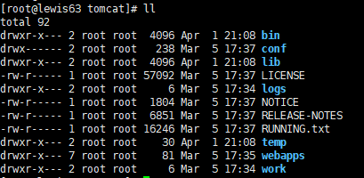
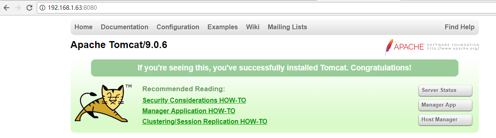
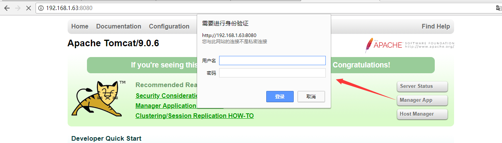
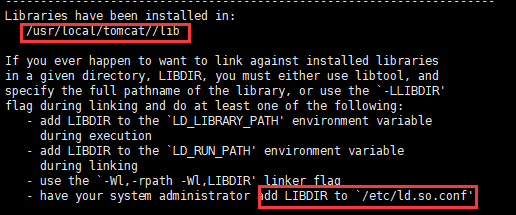
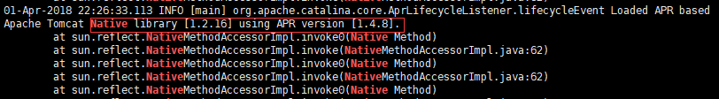

Tomcat环境搭建
==============

模式：B/S模式

端口：8080

Tomcat 服务器是一个免费的开放源代码的 Web
应用服务器，属于轻量级应用服务器，在中小型系统和并发访问用户不是很多的场合下被普遍使用，是开发和调试
JSP 程序的首选。 Tomcat 和 IIS 等 Web 服务器一样，具有处理 HTML
页面的功能。不过，Tomcat 处理静态 HTML 的能力不如 Apache 服务器。

MySQL-Connector-Java是MySQL的JDBC驱动包， 用JDBC连接MySQL数据库时必须使用该jar包

Tomcat Native 这个项目可以让 Tomcat 使用 Apache 的 apr
包来处理包括文件和网络IO操作，**以提升性能。直接说就是用tomcat-native这个软件来提高tomcat处理静态页面的性能**。这个软件在tomcat的bin目录下已经提供，不用单独去下载了！可以tomcat处理静态的性能略逊于apache！

安装JDK
-------

如果安装了openjdk，请先卸载，否则安装不了oracle官方的jdk

yum -y remove java-\*

[root\@lewis63 \~]\# tar zxf jdk-8u161-linux-x64.tar.gz -C /usr/local/

设置环境变量：

[root\@lewis63 \~]\# vim /etc/profile

export JAVA_HOME=/usr/local/jdk1.8.0_161

export JAVA_BIN=/usr/local/jdk1.8.0_161/bin

export PATH=\${JAVA_HOME}/bin:\$PATH

export CLASSPATH=.:\${JAVA_HOME}/lib/dt.jar:\${JAVA_HOME}/lib/tools.jar

[root\@lewis63 \~]\# source /etc/profile

安装Tomcat
----------

下载

wget
<http://mirrors.shu.edu.cn/apache/tomcat/tomcat-9/v9.0.6/bin/apache-tomcat-9.0.6.tar.gz>

tar zxf apache-tomcat-9.0.6.tar.gz -C /usr/local/

[root\@lewis63 local]\# mv apache-tomcat-9.0.6 tomcat 改名

各目录文件用途：

tomcat

    **\|---**bin：存放启动和关闭tomcat执行脚本；

    **\|---**conf ：存放不同的配置文件（server.xml和web.xml）；

    **\|---**lib：
包含Tomcat使用的jar文件**.**unix平台此目录下的任何文件都被加到Tomcat的classpath中；

    **\|---**logs：存放Tomcat执行时的LOG文件；

**\|---**webapps：Tomcat的主要Web发布目录（包括应用程序示例）；

    **\|---** ROOT：tomcat的家目录

        **\|---** index.jsp：Tomcat的默认首页文件

**\|---**work：存放jsp编译后产生的class文件或servlet文件存放

**\|---**temp：存放Tomcat运行时所产生的临时文件

### Tomcat启动脚本

[root\@lewis63 \~]\# vim /etc/init.d/tomcat

\#!/bin/bash

\# Tomcat init script for Linux

\# chkconfig: 2345 96 14

\# discription: The Apache Tomcat Server/JSP container

JAVA_OPTS='-server -Xms64m -Xmx128m'

JAVA_HOME=/usr/local/jdk1.8.0_161

CATALINA_HOME=/usr/local/tomcat

\$CATALINA_HOME/bin/catalina.sh \$\*

JAVA_OPTS='-server -Xms64m -Xmx128m'是用来设置JAVA相关运行参数的变量

\-server 一定要作为第一个参数，在多个CPU时性能佳

\-Xms 初始heap（堆）大小，使用最小内存大小，cpu性能高时此值应该设大一些

\-Xmx Java heap最大值，使用内存的最大值

上面两个值分配的是JVM的最小和最大值，取决于硬件的物理内存大小，建议为物理内存的一半，不超过80%

chmod +x /etc/init.d/tomcat

/etc/init.d/tomcat start 启动tomcat服务

[root\@lewis63 \~]\# netstat -anput \| grep 8080

tcp6 0 0 :::8080 :::\* LISTEN 1891/java

测试Tomcat http://ip:8080/

点击manager App,需要一个用户名和密码：

创建管理Manger App用户

vim /usr/local/tomcat/conf/tomcat-users.xml

注释去掉，修改为

\<role rolename="tomcat"/\>

\<role rolename="role1"/\>

\<role rolename="manager-gui"/\>

\<user username="admin" password="123456" roles="manager-gui"/\>

\<user username="tomcat" password="\<must-be-changed\>" roles="tomcat"/\>

\<user username="both" password="\<must-be-changed\>" roles="tomcat,role1"/\>

\<user username="role1" password="\<must-be-changed\>" roles="role1"/\>

说明

manager-gui：Allows access to the html
interface（允许通过web的方式登录查看服务器信息）

tomcat8以上还要增加配置（配置远程访问的manager）

vim /usr/local/tomcat/conf/Catalina/localhost/manager.xml

\<Context privileged="true" antiResourceLocking="false"

docBase="\${catalina.home}/webapps/manager"\>

\<Valve className="org.apache.catalina.valves.RemoteAddrValve" allow="\^.\*\$"
/\>

\</Context\>

重启tomcat

搭建基于域名的虚拟主机
----------------------

[root\@lewis63 \~]\# ls /usr/local/tomcat/conf/

Catalina catalina.properties jaspic-providers.xml logging.properties
tomcat-users.xml web.xml

catalina.policy context.xml jaspic-providers.xsd server.xml tomcat-users.xsd

server.xml是Tomcat的主配置文件（全局）,服务器设置的，例如端口设置，路径设置。

context里设置tomcat数据源，用来连接数据库。

tomcat_users主要是用户名和密码的设置。

web是默认首页等等之类的设置

[root\@lewis63 \~]\# vim /usr/local/tomcat/conf/server.xml

\<Host name="lewis.com" appBase="/var/www/html"\>

\<Context path="" docBase="/var/www/html/web1" /\>

\</Host\>

\<Host name="lewis.cn" appBase="/var/www/html"\>

\<Context path="" docBase="/var/www/html/web2" /\>

\</Host\>

[root\@lewis63 \~]\# mkdir -p /var/www/html/{web1,web2}

[root\@lewis63 \~]\# echo 'welcome to lewis63.com' \>
/var/www/html/web1/index.html

[root\@lewis63 \~]\# echo 'welcome to lewis63.cn' \>
/var/www/html/web2/index.html

[root\@lewis63 \~]\# vim /etc/hosts

192.168.1.63 lewis.com

192.168.1.63 lewis.cn

重启tomcat

安装tomcat-Native
-----------------

Tomcat Native 是一个利用 APR 来提升Tomcat性能的本地API。Tomcat 可以使用 apr
来提供更好的伸缩性、性能和集成到本地服务器技术。用来提高 tomcat 的性能。 tomcat
native 在具体的运行平台上，提供了一种优化技术，它本身是基于 APR（Apache
Portable（轻便） Runtime）技术,tomcat 可以利用 apache 的 apr
接口，使用操作系统的部分本地操作，从而提升性能APR 提升的是静态页面处理能力

Linux下，Tomcat启用APR须要三个组件：

apr

apr-util

tomcat-native.tar.gz（Tomcat自带，在bin文件夹下）

[root\@lewis63 \~]\# rpm -qa apr

apr-1.4.8-3.el7.x86_64

[root\@lewis63 \~]\# rpm -qa apr-util

apr-util-1.5.2-6.el7.x86_64

解决依赖

yum –y install apr-devel apr apr-util gcc gcc-c++ openssl-devel openssl

tomcat9 在bin下已有tomcat-native

[root\@lewis63 bin]\# tar -zxf tomcat-native.tar.gz -C /usr/local/src/

[root\@lewis63 bin]\# cd /usr/local/src/tomcat-native-1.2.16-src/

[root\@lewis63 native]\# ./configure --prefix=/usr/local/tomcat/
--with-apr=/usr/ --with-java-home=/usr/local/jdk1.8.0_161 --with-ssl

[root\@lewis63 native]\# make -j 4 && make install

安装完：提示： 需要要/etc/ld.so.conf 添加库路径/usr/local/apr/lib

添加库文件:

vim /etc/ld.so.conf

/usr/local/apr/lib \#添加此行

[root\@lewis63 native]\# ldconfig \#使动态库生效

[root\@lewis63 native]\# vim /etc/profile \#最下面加入下面一行

export LD_LIBRARY_PATH=\$LD_LIBRARY_PATH:/usr/local/tomcat/lib

[root\@lewis63 native]\# source /etc/profile

重启tomcat：/etc/init.d/tomcat stop; /etc/init.d/tomcat start

看日志看是否支持native

cat /usr/local/tomcat/logs/catalina.out \| grep Native

安装mysql
---------
