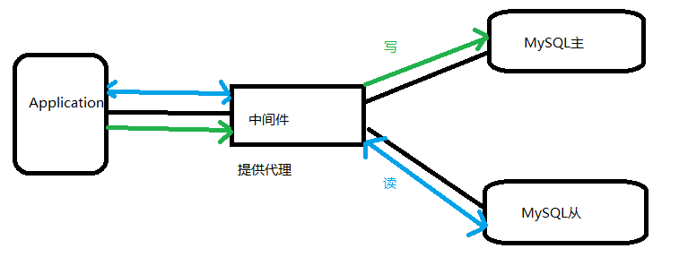
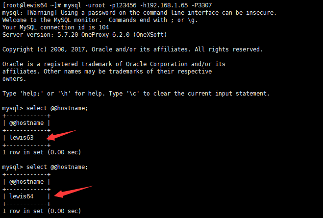

mysql配置主从 读写分离
======================

配置主从
--------

**一般来说都是通过
主从复制（Master-Slave）的方式来同步数据，再通过读写分离（MySQL-Proxy/Amoeba）来提升数据库的并发负载能力
这样的方案来进行部署与实施的。**Replication可以实现将数据从一台数据库服务器（master）复制到一或多台数据库服务器（slave）

默认情况下属于异步复制，无需维持长连接

通过配置，可以复制所有的库或者几个库，甚至库中的一些表

是MySQL内建的，本身自带的

DML:SQL操作语句，update,insert，delete

Relay log :中继日志

**mysql主从复制过程(一定要理解掌握,面试经常遇到)**

第一步：master记录二进制日志。在每个事务更新数据完成之前，master在二进制日志记录这些改变。MySQL将事务写入二进制日志，即使事务中的语句都是交叉执行的。在事件写入二进制日志完成后，master通知存储引擎提交事务。

第二步：slave将master的binary
log拷贝到它自己的中继日志。首先，slave开始一个工作线程——**I/O线程**。I/O线程在master上打开一个普通的连接，然后开始binlog
dump process。Binlog dump
process从master的二进制日志中读取事件，如果已经执行完master产生的所有文件，它会睡眠并等待master产生新的事件。I/O线程将这些事件写入中继日志。

第三步：SQL slave
thread（**SQL从线程**）处理该过程的最后一步。SQL线程从中继日志读取事件，并重新执行其中的事件而更新slave的数据，使其与master中的数据一致。

常见方案：一主多从

一般用来做读写分离的，master写，其他slave读，这种架构最大问题I/O压力集中

试验环境：

主服务器 192.168.1.63 Master mysql版本 5.7.20

从服务器 192.168.1.64 slave mysql版本 5.7.20

实验前需要确保两台服务器能够正常访问mysql，mysql服务正常开启

### 1.配置主数据库服务器

1.1 安装好数据库

1.2修改配置文件

vim /etc/my.cnf

新增加配置：

server-id=1 \#本机数据库ID标示

log-bin=master-bin \#启用二进制日志

innodb-file-per-table=ON \#使用独立的表空间,属于优化参数,可以不加

skip-name-resolve=ON \#跳过DNS解析,加快连接速度,属于优化参数,可以不加

1.3授权账号，让从数据库服务器有权限连接过来，进行同步数据

mysql\> grant replication slave on \*.\* to 'slave'\@'192.168.1.%' identified by
'123456';

mysql\> flush privileges;

**重启mysql服务**

1.4查看状态信息

mysql\> show master status;

\+-------------------+----------+--------------+------------------+-------------------+

\| File \| Position \| Binlog_Do_DB \| Binlog_Ignore_DB \| Executed_Gtid_Set \|

\+-------------------+----------+--------------+------------------+-------------------+

\| master-bin.000001 \| 154 \| \| \| \|

\+-------------------+----------+--------------+------------------+-------------------+

1 row in set (0.00 sec)

1.5查看二进制日志

[root\@lewis63 \~]\# ls /var/lib/mysql

auto.cnf client-cert.pem ib_logfile0 master-bin.index performance_schema
server-key.pem

bbs client-key.pem ib_logfile1 mysql private_key.pem sys

ca-key.pem ib_buffer_pool ibtmp1 mysql.sock public_key.pem

ca.pem ibdata1 master-bin.000001 mysql.sock.lock server-cert.pem

mysql\> show binlog events\\G

### 2．配置从数据库

**两台数据库服务器mysql版本要一致**

**并且数据库的数据要保存一致,可以导出数据库将导出的数据库传给从服务器**

**因为我们这里的数据库都是初始化状态,主从已经是一致了**

mysql\> show variables like '%version%';

\+-------------------------+------------------------------+

\| Variable_name \| Value \|

\+-------------------------+------------------------------+

\| innodb_version \| 5.7.20 \|

\| protocol_version \| 10 \|

\| slave_type_conversions \| \|

\| tls_version \| TLSv1,TLSv1.1 \|

\| version \| 5.7.20 \|

\| version_comment \| MySQL Community Server (GPL) \|

\| version_compile_machine \| x86_64 \|

\| version_compile_os \| Linux \|

\+-------------------------+------------------------------+

测试连接到主服务器是否成功

[root\@lewis64 \~]\# mysql -uslave -p123456 -h192.168.1.63

**修改从服务器配置文件**

vim /etc/my.cnf

增加：

server-id=2

relay-log-index=relay-log.index

innodb-file-per-table=ON

skip-name-resolve=ON

说明：

server-id=2 从服务器ID号，不要和主ID相同
，如果设置多个从服务器，每个从服务器必须有一个唯一的server-id值，必须与主服务器的以及其它从服务器的不相同。可以认为server-id值类似于IP地址：这些ID值能唯一识别复制服务器群集中的每个服务器实例。

重启mysql服务器：[root\@lewis64 \~]\# systemctl restart mysqld.service

**配置主从**

mysql\> change master to
master_host='192.168.1.63',master_user='slave',master_password='123456',master_log_file='master-bin.000001',master_log_pos=154;

mysql\> start slave; \#启动slave

mysql\> show slave status\\G 查看状态

**Slave_IO_Running ：一个负责与主机的io通信**

**Slave_SQL_Running：负责自己的slave mysql进程**

**注意：如果出现NO则检查防火墙和selinux是否关闭，主从mysql的UUID是否重复。若UUID重复，修改/var/lib/mysql/auto.cnf**

**再到主服务器上查看状态**

**在主数据库服务器插入数据测试同步：**

mysql\> create database bbs;

mysql\> use bbs;

mysql\> create table T1(id int,name varchar(10));

mysql\> insert into T1 values(1,'man');

从数据库上查看：

### 3.排错：

如果遇到主从不同步，看一下主从bin-log的位置，然后再同步

在主服务器上看二进制日志事件列表

mysql\> show binlog events \\G

从服务器执行MySQL命令下：

mysql\> stop slave； \#先停止slave服务

mysql\> change master to
master_log_file='mysql-bin-master.000001',master_log_pos=1164;

**\#根据上面主服务器的show master
status的结果，进行从服务器的二进制数据库记录回归，达到同步的效果**

mysql\>slave start; **\#启动从服务器同步服务**

mysql\> show slave status\\G; **\#用show slave
status\\G;看一下从服务器的同步情况**

**Slave_IO_Running: Yes**

**Slave_SQL_Running: Yes**

**如果都是yes，那代表已经在同步**

重启从服务器，再查看状态：

停止从服务器slave stop;

开启从服务器slave start;

排错思路：

1、二进制日志没有开启

2、IPTABLES 没有放开端口

3、对应的主机 IP地址写错了

**SQL线程出错**

**1、主从服务器数据库结构不统一**

**出错后，数据少，可以手动解决创建插入，再更新slave状态。**

**注：如果主上误删除了。那么从上也就误删除了。\#因此主上要定期做mysqldump备份**

mysql读写分离
-------------

Mysql作为目前世界上使用最广泛的免费数据库，相信所有从事系统运维的工程师都一定接触过。但在实际的生产环境中，由单台Mysql作为独立的数据库是完全不能满足实际需求的，无论是在安全性，高可用性以及高并发等各个方面。

因此，一般来说都是通过
主从复制（Master-Slave）的方式来同步数据，再通过读写分离（MySQL-Proxy/Amoeba）来提升数据库的并发负载能力
这样的方案来进行部署与实施的。

**读写分离工作原理**：

基本的原理是让主数据库处理事务性增、改、删操作（INSERT、UPDATE、DELETE），而从数据库处理SELECT查询操作。数据库复制被用来把事务性操作导致的变更同步到集群中的从数据库。

**数据内部交换过程：**

**为什么要读写分离：**

**面对越来越大的访问压力，单台的服务器的性能成为瓶颈，需要分担负载**

1、 主从只负责各自的写和读，极大程度的缓解X锁和S锁争用

2、 从库可配置myisam引擎，提升查询性能以及节约系统开销

3、 增加冗余，提高可用性

实现读写分离的方式：

**一般有两种方式实现**

(1)应用程序层实现，网站的程序实现

应用程序层实现指的是在应用程序内部及连接器中实现读写分离

优点：

A：应用程序内部实现读写分离，安装既可以使用

B：减少一定部署难度

C：访问压力在一定级别以下，性能很好

缺点：

A：架构一旦调整，代码要跟着变

B：难以实现高级应用，如自动分库，分表

C：无法适用大型应用场景

(2)中间件层实现

中间件层实现是指在外部中间件程序实现读写分离

常见的中间件程序：

使用oneproxy中间件实现读写分离

1. 服务器配置说明:

IP 角色 安装说明

192.168.1.65 读写分离服务器 安装oneproxy

192.168.1.63 MySQL-master MySQL mysql

192.168.1.64 MySQL-slave MySQL mysql

**2.先安装好1.63和1.64的MySQL服务,并且做好主从复制**

3.oneproxy服务安装和配置

[root\@lewis65 \~]\# wget
<http://www.onexsoft.com/software/oneproxy-rhel6-linux64-v6.0.0-ga.tar.gz>

解压：[root\@lewis65 \~]\# tar xf oneproxy-rhel6-linux64-v6.0.0-ga.tar.gz -C
/usr/local/

修改启动文件中默认读写路径

[root\@lewis65 \~]\# cd /usr/local/oneproxy/

[root\@lewis65 oneproxy]\# ls

bin demo.sh oneproxy.service sql testautocommit.sql trantest.sql

conf log README testadmin.sql testproxy.sql

[root\@lewis65 oneproxy]\# vim oneproxy.service

ONEPROXY_HOME=/usr/local/oneproxy
\#修改默认的家目录的路径,修改成oneproxy的安装目录

复制启动文件到系统启动路径下:

[root\@lewis65 oneproxy]\# cp oneproxy.service /etc/init.d

下面就可以通过命令来启动服务了:

[root\@lewis65 oneproxy]\# /etc/init.d/oneproxy.service start 启动

[root\@lewis65 oneproxy]\# /etc/init.d/oneproxy.service stop 关闭

[root\@lewis65 oneproxy]\# /etc/init.d/oneproxy.service restart 重启

**修改主配置文件,填写读写分离的相关信息:**

[root\@lewis65 oneproxy]\# cd conf/

[root\@lewis65 conf]\# vim proxy.conf

[oneproxy]

keepalive = 1 \#保持连接

event-threads = 4 \#并发连接数，最大允许48个线程。通常可以设为CPU Core数量的两倍

log-file = log/oneproxy.log \#日志文件

pid-file = log/oneproxy.pid \#进程文件

lck-file = log/oneproxy.lck \#锁文件

max-idle-time = 30 \#最大空闲时间

admin-address =:4044 \#管理服务端口

proxy-address =:3307 \#代理服务端口

proxy-socket-file =/tmp/oneproxy.sock \#sock文件

mysql-version =5.7.20 \#MySQL版本

proxy-license = A2FF461456A67F28,D2F6A5AD70C9042D

proxy-httpserver = 0.0.0.0:8080 \#管理页面地址

proxy-httptitle = OneProxy Monitor

proxy-httpauth =admin:oneproxy \#页面登录账号 密码

proxy-auto-readonly = 0

proxy-slave-addresses.1 = 192.168.1.64:3306\@server1
\#从MySQL,server1为服务组名称，任意写

proxy-master-addresses.1 = 192.168.1.63:3306\@server1
\#主MySQL,server1为服务组名称，任意写

proxy-group-policy = server1:read_balance \#代理策略,read_balance
为:主MySQL负责写, 主从负载均衡读

proxy-user-list = root/9D7E55EAF8912CCBF32069443FAC452794F8941B\@bbs

\#连接后端数据库的账户/密码\@数据库，这里的密码是加密之后的密码

remote-address.1 = 192.168.1.119:4041

proxy-part-template = conf/template.txt

proxy-part-tables = conf/part.txt

proxy-sequence-group = default

proxy-sequence.1 = seq1

要确保这个账号有权限能连接到后端数据库

**分别在主从服务器执行授权命令:**

mysql\>grant all privileges on \*.\* to 'root\@'192.168.1.%' identified by '
123456' with grant option;

mysql\> flush privileges;

**\#要确保后端数据库有bbs(名字根据实际情况来定)这个库,oneproxy就是靠这个库的存在来判断后端数据库的存活状态**

进入oneproxy中的bin目录，使用mysqlpwd对密码进行加密

[root\@lewis65 bin]\# ./mysqlpwd 123456

9D7E55EAF8912CCBF32069443FAC452794F8941B

**把得到的这一串字符串写到配置文件里**

保存文件,启动服务,测试读写分离

[root\@lewis65 conf]\# /etc/init.d/oneproxy.service start

[root\@lewis65 \~]\# netstat -antpu \| grep oneproxy

tcp 0 0 0.0.0.0:3307 0.0.0.0:\* LISTEN 1148/oneproxy

tcp 0 0 0.0.0.0:8080 0.0.0.0:\* LISTEN 1148/oneproxy

tcp 0 0 0.0.0.0:4041 0.0.0.0:\* LISTEN 1148/oneproxy

**可以通过网页浏览数据库的状态:**

通过连接oneProxy代理,测试读写分离(可以用数据库终端工具)

测试读：

测试写：

执行DDL语句提示（）：

ERROR 1044 (42000): Access denied due to security policy, DDL disabled or DML
restricted!

**解释：由于OneProxy为了安全起见，默认是禁止DDL语句的。**

**解决办法：**

1.  **oneproxy服务器配置文件**

**[root\@lewis65 \~]\# vim /usr/local/oneproxy/conf/proxy.conf**

**加入：**

**--proxy-group-security = \<server1\>:{0}**

**(2)从OneProxy管理端口，运行如下命令：**

[root\@lewis65 \~]\# mysql -uadmin -pOneProxy -P4041 -h192.168.1.65 -e "set
gaccess server1 0;"

测试：

因为主从复制效果可能看不出来，可以先关闭主从，但是生产环境往往不允许这样做

在master或slave或其它任意一台非集群的机器登录代理服务器执行

可以进行DDL语句操作，登录主从数据库查看：

**各种读写分离的主要策略简介**

master_only：读写都在主服务器上

read_failover:在主服务器正常的情况下，读写都在主库上，如果读失败，才到从库上读

read-slave:主库执行写操作，从库执行读操作

read_other:主服务器负责写，其他节点负责读

read_shard:主服务器负责写，其他节点通过一致性hash到其他节点读

read_iphash:主服务器负责写，其他节点通过IP的hash到其他节点读

read_balance：主服务器负责写，读在主与从之间轮询

write_failover:在一台主服务器写，读在所有主与从服务器上轮询

write_banlance:写在所有主服务器上轮询，写在所有主与从服务器上轮询

write_shard:读写在主和从服务器上通过一致性hash轮询

write_iphash:读写在主和从服务器上通过ip的hash轮询

big_slave：写和简单的读在主服务器上，复杂查询在从上

big_balance:写和简单的读在主服务器上，复杂查询在主和从上轮询

**参数补充:**

通过bin/oneproxy --help-all可以查看所有配置项

其选项基本上分为oneproxy模块参数(对应的功能)和应用参数
