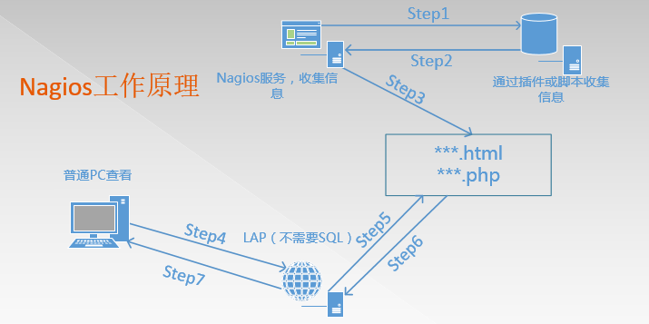
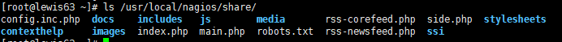
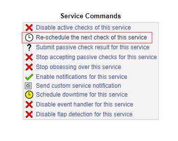
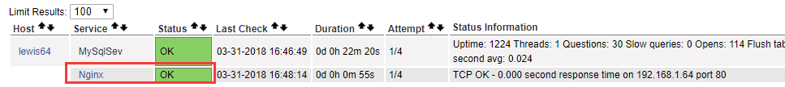

nagios监控服务搭建
==================

常见开源监控的对比和选择

cacti：

cacti不是监控工具，他是个依赖于SNMP的数据采集和数据呈现的工具。

功能： 数据采集、保存数据[SQL,txt]

数据展示（rrdtool绘图）

数据分析和报警（很一般）

nagios：

功能： 数据报警（报警功能是Nagios的特色功能）[故障触发，故障恢复都可以

依赖分析报警（能自动的识别到关键设备的故障，关联设备不会报警）

数据采集（采集的数据是弱项，他只关心警戒位，只关心正常与否的状态，状态转换时可以实现报警，所以它采集的数据不需要保存），当然也有插件弥补这个不足，如PNP4Nagios

Nagios+cacti整合互相弥补不足！

zabbix：

nagios和cacti不适合超大规模的监控、由于大规模的带宽和网络限制，会导致监控的延迟等问题，所以有很多是nagios+cacti整合，但是依然不适合在大规模的环境中，不适合分布式部署，Nagios在大规模中就会出现延迟，失去Nagios本事的特色。

那么zabbix同时整合了cacti和Nagios特点的工具，而且还具有了前两者不具有的工具，支持分布式等等。

补充工具：

netdata：托管在github上的一款类型zabbix的开源监控工具 https:/
/github.com/firehol/netdata

open-falcon：小米公司开源的企业级监控工具，用Python写的

Ganglia 类似于zabbix，大型分布式监控系统

数据采集的方式：

SNMP：简单网络管理协议

Agent：代理的方式去采集数据

Shell，脚本：通过脚本获取信息来采集

数据展示方式：

java、php、APP

报警方式：

mail、短信、及时通信工具

一．nagios监控简介
------------------

Nagios是一款开源免费的网路监视工具，可以监控的设备：Windows，Linux，Unix，Router，Switch，打印机等，具有报警功能，是一个网络监控系统。在系统或服务状态异常时发出邮件或短信报警第一时间通知网站运维人员，在状态恢复后发出正常的邮件或短信通知。

Nagios运行模式和优点

运行模式：数据收集是C/S模式，用户查看监控信息是B/S模式

优点：

1：监控网路服务状态（HTTPD，FTP，SSH，MySql……）

2：监控主机资源（处理器符合，硬盘利用率……）

3：拓展，根据自己的需求实现拓展检测功能（插件开发）

4：自动日志回滚

5：能够定义网络主机的层次,允许逐级检查,就是从父主机开始向下检查

6：警告，基于状态的警告：OK，Warning（警告），critical（关键），unknown（未知）

7：可以支持并实现对主机的冗余监控

8：Web界面可以查看当前网络状态，通知，问题历史，日志文件等

二．Nagios运行原理
------------------

Nagios的功能是监控服务和主机，但是他自身并不包括这部分功能，所有的监控、检测功能都是通过各种插件来完成的。

启动Nagios后，它会周期性的自动调用插件去检测服务器状态，同时Nagios会维持一个队列，所有插件返回来的状态信息都进入队列，Nagios每次都从队首开始读取信息，并进行处理后，把状态结果通过web显示出来。

Nagios提供了许多插件，利用这些插件可以方便的监控很多服务状态。安装完成后，在nagios主目录下的/libexec里放有nagios自带的可以使用的所有插件，如，check_disk是检查磁盘空间的插件，check_load是检查CPU负载的，等等。每一个插件可以通过运行./check_xxx
–h 来查看其使用方法和功能。

在大规模生产环境中，如果需要浏览历史数据，需要结合db

获取数据的方式：主动发送、NRPE插件、SNMP、NSClient++

Nagios 通过NRPE 来远端管理服务

1. Nagios 执行安装在它里面的check_nrpe 插件，并告诉check_nrpe 去检测哪些服务。

2. 通过SSL，check_nrpe 连接远端机子上的NRPE daemon

3. NRPE 运行本地的各种插件去检测本地的服务和状态(check_disk,..etc)

4. 最后，NRPE 把检测的结果传给主机端的check_nrpe，check_nrpe
再把结果送到Nagios状态队列中。

5. Nagios 依次读取队列中的信息，再把结果显示出来。

三．安装
--------

此方法同样适用新版本

### 3.1 环境

LAP环境，不需要mysql

需要准备软件包如下：

nagios-3.5.1.tar.gz
\#Nagios核心文件，Nagios服务文件，不建议用最新，很多插件没做好

nagios-plugins-2.1.1.tar.gz \#Nagios插件，用于存放脚本和命令

NSCP-0.5.0 \#也就是Nsclient++，用来监控Windows，分为64位、32位版本

nrpe-2.15.tar.gz \#代理服务，用于监控非Nagios服务器的服务器本地私有信息代理

解决依赖和安装LAP环境

Centos7安装epel源

yum -y install epel-release

yum clean all && yum list

yum install -y gcc glibc glibc-common php gd gd-devel libpng libmng libjpeg zlib

yum install -y httpd

systemctl start httpd

systemctl enable httpd

### 3.2 安装nagios

创建Nagios运行用户

useradd nagios

groupadd nagcmd

Nagios和apache加入该组

usermod -G nagcmd nagios

usermod -G nagcmd apache

Nagios核心安装

[root\@lewis63 \~]\# mkdir Nagios \#所有软件包放在此目录下

[root\@lewis63 \~]\# cd Nagios;ls

nagios-3.5.1.tar.gz nagios-plugins-2.1.1.tar.gz nrpe-2.15.tar.gz

[root\@lewis63 Nagios]\# tar zxf nagios-3.5.1.tar.gz -C /usr/local/src/

[root\@lewis63 Nagios]\# cd /usr/local/src/nagios/

[root\@lewis63 nagios]\# ./configure --with-command-group=nagcmd

[root\@lewis63 nagios]\# make all

[root\@lewis63 nagios]\# make install && make install-init && make
install-commandmode && make install-config && make install-webconf

若是单步执行，每次执行一部，都会提示你下一步需要干什么

到此时，安装过程就结束，在安装的时候，make
install生成share这个目录，这个目录是访问界面目录

说明：

在安装的时候，make install生成share这个目录，这个目录是访问界面目录

在make install-init的时候，生成启动脚本

[root\@lewis63 \~]\# ls /etc/init.d/nagios

/etc/init.d/nagios **其实就是在/etc/rc.d/init.d/nagios**

在make install-config的时候，生成了Nagios的相关配置文件

[root\@lewis63 \~]\# ls /usr/local/nagios/etc/

cgi.cfg nagios.cfg objects resource.cfg

包括以后安装了plugin等软件后，配置文件也会放入此目录

resource.cfg:定义了很多资源变量的调用

在make
install-webconf的时候，已经把web-conf的配置文件放入了/etc/httpd/conf.d/下面

[root\@lewis63 \~]\# ls /etc/httpd/conf.d/nagios.conf

/etc/httpd/conf.d/nagios.conf

里面配置了一个别名，直接引用了/usr/local/nagios/share目录

Nagios主目录

[root\@lewis63 \~]\# ll /usr/local/nagios/

bin \#Nagios执行程序所在目录

etc \#nagios配置文件所在目录，初始安装只有几个\*.cfg文件

libexec
\#监控所用命令，需要安装了nagios-plugins插件了才会有，检测命令，不装是空的

sbin \#Nagios的Cgi文件所在目录，外部命令所需要的文件存放目录

share \#Nagios前端页面

var \#日志文件，pid文件等

认识一下nagios的配置文件

vim /usr/local/nagios/etc/nagios.cfg

log_file=/var/log/nagios/nagios.log \#日志位置

cfg_file=/etc/nagios/objects/commands.cfg \#这个文件定义了很多命令

cfg_file=/etc/nagios/objects/contacts.cfg \#定义联系人，怎么联系

cfg_file=/etc/nagios/objects/timeperiods.cfg \#定义了时间段

cfg_file=/etc/nagios/objects/templates.cfg \#模板（联系人，主机，时间）

cfg_file=/etc/nagios/objects/localhost.cfg \#监控本机相关配置文件

\#cfg_file=/etc/nagios/objects/windows.cfg \#windows，默认不监控

\#cfg_file=/etc/nagios/objects/switch.cfg \#交换机路由器监控，默认不监控

\#cfg_file=/etc/nagios/objects/printer.cfg \#打印机监控，默认不监控

\#cfg_dir=/etc/nagios/servers \#定义了服务合集（多个使用）

\#cfg_dir=/etc/nagios/printers \#定义了打印机合集（多个使用）

\#cfg_dir=/etc/nagios/switches \#定义了交换合集（多个使用）

\#cfg_dir=/etc/nagios/routers \#定义了路由合集（多个使用）

resource_file=/etc/nagios/private/resource.cfg
资源变量配置文件，包括\$USER1\$变量（一个路径）等

status_update_interval=10 \#状态更新时间，单位s

log_rotation_method=d \#日志滚动，默认天

service_check_timeout=60 \#服务检查超时时间

host_check_timeout=30 \#主机检查超时时间

event_handler_timeout=30

notification_timeout=30

ocsp_timeout=5

perfdata_timeout=5

vim /usr/local/nagios/etc/cgi.cfg //此配置文件比nagios.cfg优先级高

main_config_file= /usr/local/nagios/etc/nagios.cfg \#主配置文件

physical_html_path= /usr/local/nagios/share \#物理路径

url_html_path=/nagios \#在URL后面加上/nagios才能访问

use_authentication=1 \#使用认证

use_ssl_authentication=0 \#不使用ssl

authorized_for_system_information=nagiosadmin \#认证用户

Nagios访问测试

[root\@lewis63 \~]\# systemctl restart httpd

浏览器打开<http://ip/nagios>

需要用户名和密码，查看vim /etc/httpd/conf.d/nagios.conf配置文件

在Directory字段里面有Auth这三个字段，那么就可以使用htpasswd来生成用户名和密码

[root\@lewis63 \~]\# htpasswd -c /usr/local/nagios/etc/htpasswd.users
nagiosadmin

New password:

Re-type new password:

Adding password for user nagiosadmin

\-c表示创建，二次添加用户，不能使用-c参数

\#nagios 默认使用nagiosadmin来管理，如果使用其他用户名，对应的配置文件也要修改

systemctl restart httpd

生成启动脚本

[root\@lewis63 \~]\# chmod +x /etc/init.d/nagios

[root\@lewis63 \~]\# vim /usr/lib/systemd/system/nagios.service

[Unit]

Description=nagios

After=network.target

[Service]

Type=forking

ExecStart=/etc/init.d/nagios start

ExecReload=/etc/init.d/nagios restart

ExecStop=/etc/init.d/nagios stop

PrivateTmp=true

[Install]

WantedBy=multi-user.target

将服务添加到系统启动服务中：systemctl enable nagios

启动nagios服务: systemctl start nagios 或者 /etc/init.d/nagios start

检查配置文件:在nagios的目录下，bin目录下有一个nagios命令，这个命令可以帮助我们对配置文件的检查工作以及指定相关配置文件(下图代表没有问题)

[root\@lewis63 \~]\# /usr/local/nagios/bin/nagios -v
/usr/local/nagios/etc/nagios.cfg

### 3.3安装Nagios-plugins插件

为了后面的实验要求，先把mysql客户端安装了

[root\@lewis63 \~]\# yum -y install mysql mysql-devel

Nagios-plugins含有丰富的检测命令插件，安装完成之后放在了/usr/local/Nagios/libexec下面

[root\@lewis63 Nagios]\# tar zxf nagios-plugins-2.1.1.tar.gz -C /usr/local/src/

[root\@lewis63 Nagios]\# cd /usr/local/src/nagios-plugins-2.1.1/

[root\@lewis63 nagios-plugins-2.1.1]\# ./configure --with-nagios-user=nagios
--with-nagios-group=nagcmd

[root\@lewis63 nagios-plugins-2.1.1]\# make –j 4 && make install

已经有了很多check命令

启动Nagios服务，检查环境

[root\@lewis63 \~]\# systemctl restart httpd; /etc/init.d/nagios restart

浏览器测试：登陆之后，点击hosts，可以看到，默认监控的是本机，说明环境没有什么问题

四．监控本服务器
----------------

流程：指定主配置文件需要加载的配置文件—定义主机—定义服务
–定义监控命令—检查配置文件—启动Nagios

**监控本地NFS状态**

[root\@lewis63 \~]\# cd /usr/local/nagios/etc/objects/

[root\@lewis63 objects]\# cp localhost.cfg localhost.cfg.bak \#备份配置文件

[root\@lewis63 objects]\# vim localhost.cfg

\#NFS

define service{

use local-service ; Name of service template to use

host_name localhost

service_description NFS

check_command check_tcp!2049

notifications_enabled 0

}

\#在使用check命令之前，要确保下/usr/local/nagios/libexec/
目录下有没有你需要的check命令，如果有，直接调用，如果没有，检测端口来代替，检测格式：
check_tcp!端口号

[root\@lewis63 objects]\# vim /etc/exports \#创建一个共享

/tmp \*(rw)

[root\@lewis63 \~]\# systemctl restart nfs

[root\@lewis63 \~]\# showmount -e 192.168.1.63 \#检测NFS目前是否正常

Export list for 192.168.1.63:

/tmp \*

检测配置文件是否有误

[root\@lewis63 \~]\# /usr/local/nagios/bin/nagios -v
/usr/local/nagios/etc/nagios.cfg

Total Warnings: 0

Total Errors: 0

重启nagios服务：systemctl restart nagios

正在检查，稍等一会

或者手动强制刷新，不需要等待

点击NFS,有个Re-schedule the next check of this service

一般状态有四种颜色，如下图

五．监控远程服务器
------------------

### 5.1Nagios监控远程MYSQL 数据库状态

**监控任何一台服务器，工作流程是定义主机，定义服务，定义命令**

[root\@lewis64 \~]\# yum -y install mysql mysql-server

[root\@lewis64 \~]\# systemctl start mysqld

创建一个测试数据库

[root\@lewis64 \~]\# mysql -uroot –p

mysql\> create database nagios;

mysql\> grant select on nagios.\* to 'nagios'\@'192.168.1.63' identified by
'123456';

lewis63上配置Nagios服务

[root\@lewis63 \~]\# vim /usr/local/nagios/etc/nagios.cfg

添加下面两行

cfg_file=/usr/local/nagios/etc/objects/hosts.cfg

cfg_file=/usr/local/nagios/etc/objects/service.cfg

[root\@lewis63 \~]\# vim /usr/local/nagios/etc/objects/hosts.cfg

define host{

use linux-server

host_name lewis64

address 192.168.1.64

}

[root\@lewis63 \~]\# vim /usr/local/nagios/etc/objects/service.cfg

define service{

use local-service

host_name lewis64

service_description MySqlSev

check_command check_mysql

}

[root\@lewis63 \~]\# vim /usr/local/nagios/etc/objects/commands.cfg

\#MYSQL command

define command{

command_name check_mysql

command_line \$USER1\$/check_mysql -H \$HOSTADDRESS\$ -u nagios -p123456 -d
nagios

}

手动检测command.cfg的命令有效性

[root\@lewis63 \~]\# /usr/local/nagios/libexec/check_mysql -H 192.168.1.64 -u
nagios -p123456 -d nagios

Uptime: 882 Threads: 1 Questions: 7 Slow queries: 0 Opens: 107 Flush tables: 1
Open tables: 100 Queries per second avg: 0.007\|Connections=5c;;;
Open_files=16;;; Open_tables=101;;; Qcache_free_memory=1031832;;;
Qcache_hits=0c;;; Qcache_inserts=0c;;; Qcache_lowmem_prunes=0c;;;
Qcache_not_cached=1c;;; Qcache_queries_in_cache=0;;; Queries=8c;;;
Questions=5c;;; Table_locks_waited=0c;;; Threads_connected=1;;;
Threads_running=1;;; Uptime=882c;;;

注意：所有的check_command字段中的所使用的命令，必须在command.cfg中定义好才能使用，而command.cfg中的command_line中使用的命令，必须在/usr/local/Nagios/libexec/目录下存在，安装plugins会生成

**注意：服务器要安装了mysql客户端软件，然后再重新编译安装下plugins
才会生成check_mysql**

[root\@lewis64 \~]\# systemctl stop mysqld \#lewis64停掉服务再检测

[root\@lewis63 \~]\# /usr/local/nagios/libexec/check_mysql -H 192.168.1.64 -u
nagios -p123456 -d nagios

**Can't connect to MySQL server on '192.168.1.64' (111)**

[root\@lewis63 \~]\# systemctl restart nagios

**刚才已停掉数据库 监控提示警告严重状态**

[root\@lewis64 \~]\# systemctl start mysqld \#lewis64 重新启动mysql服务

### 5.2定义监控web服务

[root\@lewis63 \~]\# vim /usr/local/nagios/etc/objects/hosts.cfg

define host{

use linux-server

host_name lewis64

address 192.168.1.64

}

\#上面定义过lewsis64的主机，无需重复定义

[root\@lewis63 \~]\# vim /usr/local/nagios/etc/objects/service.cfg

define service{

use local-service

host_name lewis64

service_description Nginx

check_command check_nginx

}

[root\@lewis63 \~]\# vim /usr/local/nagios/etc/objects/commands.cfg

\#Nginx command

define command{

command_name check_nginx

command_line \$USER1\$/check_tcp -H \$HOSTADDRESS\$ -p 80

}

[root\@lewis63 \~]\# /etc/init.d/nagios restart \#重启测试nginx

### 5.3 Nagios监控外部主机私有信息

私有信息，包括默认的硬盘使用，进程数目，SWAP分区等等

私有信息，就是我需要在本机登陆操作登陆的

非私有，就是可以通过远程的方式

只有监控私有信息的时候，才调用NRPE这个插件来通信

nrpe插件

通过NRPE（一个插件）服务可以添加本地信息的监控，将数据发送到我们的Nagios服务器

NRPE两部分组成，一部分是监控机check_nrpe，一部分是被监控机的NRPE守护进程

Nagios 服务器执行check_nrpe 插件并告诉他检查哪个服务，check_nrpe 插件通过SSL
连接方式联系远程服务器上的NRPE守护进程，NRPE守护进程执行相应的插件完成指定的检查，并返回结果。

**Nrpe是基于SSL的机制，那么我们需要做的事情就是构建SSL环境，所以需要使用NRPE工作的时候，都需要安装SSL，而且服务端和客户端都需要安装nrpe软件，而我们客户端不需要安装NAGIOS服务端**

解决依赖

实验所需设备都需要安装SSL的支持

[root\@lewis63 \~]\# yum -y install openssl openssl-devel

[root\@lewis64 \~]\# yum -y install openssl openssl-devel

[root\@lewis63 Nagios]\# tar zxf nrpe-2.15.tar.gz -C /usr/local/src/

[root\@lewis63 \~]\# cd /usr/local/src/nrpe-2.15/

[root\@lewis63 nrpe-2.15]\# ./configure && make && make install \#安装插件

[root\@lewis63 nrpe-2.15]\# make install-plugin && make install-daemon
\#以守护进程运行

[root\@lewis63 nrpe-2.15]\# ls /usr/local/nagios/libexec/check_nrpe

/usr/local/nagios/libexec/check_nrpe \#这个命令需要安装nrpe才会有

客户端配置

需要安装nagios-plugins nrpe

[root\@lewis64 \~]\# useradd -s /sbin/nologin nagios

[root\@lewis64 \~]\# groupadd nagcmd

[root\@lewis64 \~]\# usermod -G nagcmd nagios

[root\@lewis64 \~]\# yum -y install xinetd

[root\@lewis64 \~]\# tar zxf nagios-plugins-2.1.1.tar.gz -C /usr/local/src/

[root\@lewis64 \~]\# tar zxf nrpe-2.15.tar.gz -C /usr/local/src/

[root\@lewis64 \~]\# cd /usr/local/src/nagios-plugins-2.1.1/

[root\@lewis64 nagios-plugins-2.1.1]\# ./configure && make && make install

[root\@lewis64 nagios-plugins-2.1.1]\# cd ../nrpe-2.15/

[root\@lewis64 nrpe-2.15]\# ./configure && make && make install

[root\@lewis64 nrpe-2.15]\# make install-daemon-config
\#客户端，不用make-install-plugin

[root\@lewis64 nrpe-2.15]\# make install-xinetd

[root\@lewis64 \~]\# vim /etc/xinetd.d/nrpe

service nrpe

{

flags = REUSE

socket_type = stream

port = 5666

wait = no

user = nagios

group = nagios

server = /usr/local/nagios/bin/nrpe

server_args = -c /usr/local/nagios/etc/nrpe.cfg --inetd

log_on_failure += USERID

disable = no

only_from = 127.0.0.1 192.168.1.63 \#添加红色 nagios服务器地址,
允许63这台机器来连接自己的nrpe服务，多个IP地址空格分隔

}

[root\@lewis64 \~]\# echo "nrpe 5666/tcp \#NRPE" \>\> /etc/services \#端口注册

/etc/services文件的作用：

作用1：xinet.d来启动服务时他就会在/etc/services找相应服务对应的端口来启动服务。找不到对应端口，将不启动服务。

作用2: 显示对应端口对应的协议名。

例如 iptables -L 不加-n参数， 查看时，把 80转 -\> www http

作用3：查看常用端口

[root\@lewis64 \~]\# systemctl restart xinetd

[root\@lewis64 \~]\# systemctl enable xinetd

[root\@lewis64 \~]\# netstat -anput \| grep 5666

tcp6 0 0 :::5666 :::\* LISTEN 27191/xinetd

客户端nrpe命令

[root\@lewis64 \~]\# swapon –s \#查看swap挂载 使用情况

Filename Type Size Used Priority

/dev/dm-1 partition 2097148 0 -1

[root\@lewis64 \~]\# vim /usr/local/nagios/etc/nrpe.cfg

command[check_load]=/usr/local/nagios/libexec/check_load -w 15,10,5 -c 30,25,20

command[check_root]=/usr/local/nagios/libexec/check_disk -w 20% -c 10% -p
/dev/mapper/centos-root

command[check_swap]=/usr/local/nagios/libexec/check_disk -w 20% -c 10% -p
/dev/dm-1

command[check_total_procs]=/usr/local/nagios/libexec/check_procs -w 150 -c 200

\-w为警告 -C为告急，swap中，是指剩余20%告警，10%告急

服务端手动测试

[root\@lewis63 libexec]\# ./check_nrpe -H 192.168.1.64

NRPE v2.15

[root\@lewis63 \~]\# /usr/local/nagios/libexec/check_nrpe -H 192.168.1.64 -c
check_root

DISK OK - free space: / 7480 MB (73% inode=98%);\| /=2749MB;8184;9207;0;10230

**如果出现以一下错误，说明没有允许192.168.1.63 访问我们的lewis64服务**

\#CHECK_NRPE: Error - Could not complete SSL handshake.

我们需要检查/etc/init.d/nrpe 下面的only from中的有无添加192.168.1.63

定义被监控主机

[root\@lewis63 \~]\# vim /usr/local/nagios/etc/objects/hosts.cfg

define host{

use linux-server

host_name lewis64

address 192.168.1.64

}

定义需要监控的服务，分别监控root分区 swap分区 进程总数 负载

[root\@lewis63 \~]\# vim /usr/local/nagios/etc/objects/service.cfg

define service{

use local-service

host_name lewis64

service_description root_Parition

check_command check_nrpe!check_root

}

define service{

use local-service

host_name lewis64

service_description swap_Parition

check_command check_nrpe!check_swap

}

define service{

use local-service

host_name lewis64

service_description Total Processes

check_command check_nrpe!check_total_procs

}

define service{

use local-service

host_name lewis64

service_description Current Load

check_command check_nrpe!check_load

}

定义NRPE监控命令

[root\@lewis63 \~]\# vim /usr/local/nagios/etc/objects/commands.cfg

define command{

command_name check_nrpe

command_line \$USER1\$/check_nrpe -H \$HOSTADDRESS\$ -c \$ARG1\$

}

\$ARG1\$ 表示调用后面的参数

[root\@lewis63 \~]\# /etc/init.d/nagios restart

总结：

1: 服务端监控（无需NRPE）

定义主机，定义服务，定义命令，测试命令，启动

2：有NRPE的监控

定义主机，定义服务（check_nrpe!check_ping）,定义命令（定义的是check_nrpe）

3：还有一个定义命令（客户端做 command[check_adfadf]） -w –c

安装好之后，是依赖于xinetd服务启动的

六．配置邮件报警
----------------

[root\@lewis63 \~]\# yum install -y sendmail mailx –y

[root\@lewis63 \~]\# systemctl start sendmail

[root\@lewis63 \~]\# systemctl enable sendmail

[root\@lewis63 \~]\# vim /usr/local/nagios/etc/objects/contacts.cfg

define contact{

contact_name nagiosadmin

use generic-contact

alias Nagios Admin

email <921736904@qq.com> \#修改为自己的邮箱

}

[root\@lewis63 \~]\# vim /usr/local/nagios/etc/nagios.cfg

enable_notifications=1 \#开启邮件告警

[root\@lewis63 \~]\# vim /etc/mail.rc

set from=xiaokai0312\@163.com

set smtp=smtp.163.com

set smtp-auth-user=xiaokai0312\@163.com

set smtp-auth-password=xxx \#授权码

set smtp-auth=login

[root\@lewis64 \~]\# systemctl stop mysqld \#停止mysql服务

[root\@lewis63 \~]\# /etc/init.d/nagios restart

七．安装pnp4nagios图形分析
--------------------------

参考：https://blog.csdn.net/jie_linux/article/details/78604426

安装组件

[root\@lewis63 \~]\# yum –y install perl-Time-HiRes rrdtool rrdtool-perl
[root\@lewis63 \~]\# tar zxf pnp4nagios-0.6.26.tar.gz -C /usr/local/src/

[root\@lewis63 \~]\# cd /usr/local/src/pnp4nagios-0.6.26/

[root\@lewis63 pnp4nagios-0.6.26]\# ./configure
--prefix=/usr/local/nagios/pnp4nagios --with-nagios-user=nagios
--with-nagios-group=nagcmd

[root\@lewis63 pnp4nagios-0.6.26]\# make all

[root\@lewis63 pnp4nagios-0.6.26]\# make install && make install-webconf && make
install-config && make install-init

[root\@lewis63 etc]\# mv misccommands.cfg-sample misccommands.cfg

[root\@lewis63 etc]\# mv nagios.cfg-sample nagios.cfg

[root\@lewis63 etc]\# mv rra.cfg-sample rra.cfg

[root\@lewis63 etc]\# pwd

/usr/local/nagios/pnp4nagios/etc

[root\@lewis63 etc]\# cd pages/

[root\@lewis63 pages]\# mv web_traffic.cfg-sample web_traffic.cfg

[root\@lewis63 pages]\# cd ../check_commands/

[root\@lewis63 check_commands]\# mv check_all_local_disks.cfg-sample
check_all_local_disks.cfg

[root\@lewis63 check_commands]\# mv check_nrpe.cfg-sample check_nrpe.cfg

[root\@lewis63 check_commands]\# mv check_nwstat.cfg-sample check_nwstat.cfg

**启动npcd**

[root\@lewis63 \~]\# /usr/local/nagios/pnp4nagios/bin/npcd -d -f
/usr/local/nagios/pnp4nagios/etc/npcd.cfg

[root\@lewis63 \~]\# chkconfig npcd on

[root\@lewis63 \~]\# vim /usr/local/nagios/etc/nagios.cfg

将process_performance_data=0  修改为  process_performance_data=1

将以下两项的\#去掉

host_perfdata_command=process-host-perfdata

service_perfdata_command=process-service-perfdata
