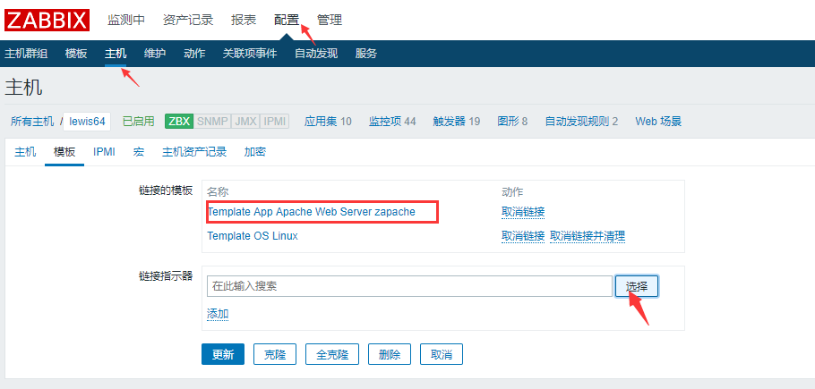
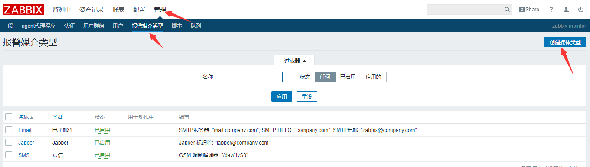
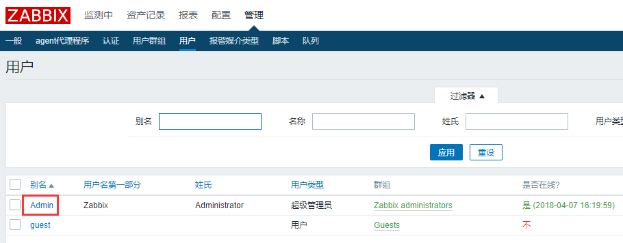

zabbix源码搭建
==============

环境：LNMP+zabbix3.4

整个环境所需要的软件包

php-5.6.13

libmcrypt-2.5.8

mysql-5.6.26

nginx-1.8.0

zabbix-3.4.3

1.  **创建导入zabbix数据库**

[root\@lewis63 \~]\# mysql -uroot -p

mysql\> create database zabbix;

mysql\> create database zabbix;

mysql\> flush privileges;

[root\@lewis63 \~]\# tar zxf zabbix-3.4.3.tar.gz -C /usr/local/src/

[root\@lewis63 \~]\# cd /usr/local/src/zabbix-3.4.3/

**导入数据库，注意顺序，否则会报错**

[root\@lewis63 zabbix-3.4.3]\# mysql -uzabbix -pzabbix zabbix \<
database/mysql/schema.sql

[root\@lewis63 zabbix-3.4.3]\# mysql -uzabbix -pzabbix zabbix \<
database/mysql/images.sql

[root\@lewis63 zabbix-3.4.3]\# mysql -uzabbix -pzabbix zabbix \<
database/mysql/data.sql

1.  **编译zabbix**

[root\@lewis63 \~]\# groupadd zabbix

[root\@lewis63 \~]\# useradd -s /sbin/nologin -g zabbix zabbix \#创建用户

解决依赖

yum install -y net-snmp-devel

yum install -y libevent libevent-devel

[root\@lewis63 zabbix-3.4.3]\# ./configure --prefix=/usr/local/zabbix
--enable-server --enable-agent --with-mysql=/var/lib/mysql/bin/mysql_config
--with-net-snmp --with-libcurl参数说明:

\--prefix= \#指定路径

\--enable-server \#Server 支持

\--enable-agent \#支持 Zabbix 客户端

\--with-mysql \#指定 MySql 库可以选择自定路径 mysql_config，mysql_config
是命令，用于编译 mysql 客户端程序

\--with-net-snmp \#支持 snmp 协议，需要安装 net-snmp-devel 包

\--with-libcurl \#支持 CURL 功能，libcurl
主要功能就是用不同的协议连接不同的服务器，

libcurl 当前支持的协议有 http，https，ftp，gopher，telent，dict，file，和 ldap
协议

其他参数：

\--enable-proxy 指的是支持 zabbix 代理服务器，zabbix proxy
是一个监控代理服务器，它收集到监控数据，选存放在缓冲区，保存的时间可以通过配置文件设定，然后再传送的
zabbix server。监控代理服务需要一个独立的数据库。

用 zabbix proxy
的好处：进程监控，当监控的位置通信不便时，当通讯上千台设备的时候，使用
zabbix_proxy 可以简化维护分布式监控，降低 zabbix server 的负负载

\*\*\*\*\*\*\*\*\*\*\*\*\*\*\*\*\*\*\*\*\*\*\*\*\*\*\*\*\*\*\*\*\*\*\*\*\*\*\*\*\*\*\*\*\*\*\*\*\*\*\*\*\*\*\*\*\*\*\*

\* Now run 'make install' \*

\* \*

\* Thank you for using Zabbix! \*

\* \<http://www.zabbix.com\> \*

\#按上面的提示，没有 make 步骤，直接 make install

[root\@lewis63 zabbix-3.4.3]\# make install

**3.配置 zabbix Server**

[root\@lewis63 \~]\# vim /usr/local/zabbix/etc/zabbix_server.conf

DBHost=localhost \#默认注释掉了，直接取消注释即可

DBName=zabbix \#数据库用户，我们授权的用户也是zabbix

DBUser=zabbix \#默认是 root，我们授权的用户是 zabbix

DBPassword=zabbix \#密码我们授权的也是 zabbix

**4.监控 Zabbix Server 本身**

监控本身，意思是本身作为服务器之外，自己也做自己的客户端，也要使用agentd这个代理者
配置文件中，有 agentd 和 agent 两个配置文件，前者是守护进程，后者依赖 xinetd

[root\@lewis63 \~]\# vim /usr/local/zabbix/etc/zabbix_agentd.conf

Server=127.0.0.1 \#默认监控服务器自己，这三行不用改

ServerActive=127.0.0.1

Hostname=Zabbix server

UnsafeUserParameters=1
\#允许所有的字符是在用户定义的参数，参数传递，也就是支持自定义脚本

其中 Server 和 ServerActive 都指定 zabbixserver 的 IP
地址，不同的是，前者是被动后者是主动。也就是说前者允许 127.0.0.1 这个 ip
来我这取数据。而 serverActive 的 127.0.0.1 的意思是，客户端主动提交数据给他

**5.启动服务**

直接运行

[root\@lewis63 \~]\# /usr/local/zabbix/sbin/zabbix_server

/usr/local/zabbix/sbin/zabbix_server: error while loading shared libraries:
libmysqlclient.so.18: cannot open shared object file: No such file or directory

报错解决

[root\@lewis63 \~]\# vim /etc/ld.so.conf \#解决库文件找不到

include ld.so.conf.d/\*.conf

/usr/local/mysql/lib/ \#根据实际路径添加此行

[root\@lewis63 \~]\# ldconfig \#使库文件生效

[root\@lewis63 \~]\# echo /usr/local/zabbix/sbin/zabbix_server \>\>
/etc/rc.local \#开机启动

[root\@lewis63 \~]\# /usr/local/zabbix/sbin/zabbix_server

[root\@lewis63 \~]\# netstat -anput \| grep zabbix_server

tcp 0 0 0.0.0.0:10051 0.0.0.0:\* LISTEN 55457/zabbix_server

\#server 运行端口 10051

**6. 编辑 php 页面控制文件**

默认配置文件没有写入到我们的 Nginx 的配置文件中，也就是不能加载到我们的 zabbix
页面目录

[root\@lewis63 \~]\# cp -r /usr/local/src/zabbix-3.4.3/frontends/php/\*
/usr/local/nginx/html/

[root\@lewis63 \~]\# vim /usr/local/nginx/conf/nginx.conf

location / {

root html;

index **index.php** index.html index.htm; \#找到此行内容，添加index.php

}

重启nginx服务和php-fpm服务

[root\@lewis63 \~]\# nginx -s reload

[root\@lewis63 \~]\# /etc/init.d/zabbix_server restart

[root\@lewis63 \~]\# /etc/init.d/php-fpm restart

7. 打开网页安装 zabbix web

打开浏览器输入<http://192.168.1.63>

开始检查环境

编辑 php.ini 文件，修改环境

[root\@lewis63 \~]\# vim /usr/local/php/php.ini

post_max_size = 16M \#修改

max_execution_time = 300 \#修改

max_input_time = 300 \#修改

date.timezone = Asia/Shanghai \#此行有注释，去注释并修改

always_populate_raw_post_data = -1 \#此行取消注释即可

mysqli.default_socket = /var/lib/mysql/mysql.sock \#指定php连接mysql的sock路径

[root\@lewis63 \~]\# /etc/init.d/php-fpm restart\#重启fpm

刷新页面

如果提示没有安装PHP
LDAP模块，为了不影响后面的功能，现在把这个模块重新编译安装进去

[root\@lewis63 \~]\# cd /usr/local/src/php-7.0.18/ext/ldap/

[root\@lewis63 ldap]\# /usr/local/php/bin/phpize

Configuring for:

PHP Api Version: 20151012

Zend Module Api No: 20151012

Zend Extension Api No: 320151012

[root\@lewis63 ldap]\# ./configure
--with-php-config=/usr/local/php/bin/php-config --with-ldap

上面的过程会报错,提示缺少库文件

yum install openldap-devel openldap –y

[root\@lewis63 \~]\# rsync -avz /usr/lib64/libldap\* /usr/lib/

再次编译，即可通过

[root\@lewis63 ldap]\# ./configure
--with-php-config=/usr/local/php/bin/php-config --with-ldap

[root\@lewis63 ldap]\# make && make install

[root\@lewis63 ldap]\# vim /usr/local/php/php.ini

添加：extension=ldap.so

[root\@lewis63 ldap]\# /etc/init.d/php-fpm restart

再次刷新即可

**这里Database host 需要改为127.0.0.1**

**下载这个配置文件上传上去**

**[root\@lewis63 \~]\# mv zabbix.conf.php /usr/local/nginx/html/conf**

然后刷新

默认用户名和密码分别为 Admin，zabbix

点击右上角用户，然后选择语言

点击配置-主机 启用本主机（默认没有启动，点击后面红色的停用，则启用）

把zabbix_agent 也启动起来

[root\@lewis63 \~]\# /usr/local/zabbix/sbin/zabbix_agentd

再次刷新页面，可以看到，agent状态已经正常

可以看到已经开始出图

**7.图表字符乱码的解决办法**

在window系统C:\\Windows\\Fonts找到一个ttf字体文件，

[root\@lewis63 \~]\# cd /usr/local/nginx/html/fonts/

[root\@lewis63 \~]\# mv DejaVuSans.ttf DejaVuSans.bak

[root\@lewis63 \~]\# mv simli.ttf DejaVuSans.ttf \#重命名成DejaVuSans.ttf

二．配置监控远程主机
--------------------

### 2.1客户端安装配置

1.解决依赖：

[root\@lewis64 \~]\# yum install -y curl curl-devel net-snmp net-snmp-devel
perl-DBI

[root\@lewis64 \~]\# useradd -M -s /sbin/nologin zabbix

[root\@lewis64 \~]\# tar zxf zabbix-3.4.3.tar.gz -C /usr/local/src/

[root\@lewis64 \~]\# cd /usr/local/src/zabbix-3.4.3/

[root\@lewis64 zabbix-3.4.3]\# ./configure --prefix=/usr/local/zabbix
--enable-agent

[root\@lewis64 zabbix-3.4.3]\# make install

[root\@lewis64 \~]\# cat /etc/services\|grep zabbix

zabbix-agent 10050/tcp \# Zabbix Agent

zabbix-agent 10050/udp \# Zabbix Agent

zabbix-trapper 10051/tcp \# Zabbix Trapper

zabbix-trapper 10051/udp \# Zabbix Trapper

2.启动agent

[root\@lewis64 \~]\# /usr/local/zabbix/sbin/zabbix_agentd

[root\@lewis64 \~]\# cp
/usr/local/src/zabbix-3.4.3/misc/init.d/fedora/core5/zabbix_agentd /etc/init.d/

[root\@lewis64 \~]\# vim /etc/init.d/zabbix_agentd

ZABBIX_BIN="/usr/local/zabbix/sbin/zabbix_agentd" \#修改此行

[root\@lewis64 \~]\# chkconfig --add zabbix_agentd

[root\@lewis64 \~]\# chkconfig zabbix_agentd on

1.  配置 Agentd 的配置文件

[root\@lewis64 \~]\# vim /usr/local/zabbix/etc/zabbix_agentd.conf

Server=192.168.1.63 \#zabbix server 地址，可以多个，用，隔开

ServerActive=192.168.1.63 \#主动检查的意思,主动检查主机的数据的数据发送给 Zabbix
Server

Hostname=lewis64

UnsafeUserParameters=1

重启服务：[root\@lewis64 \~]\# /etc/init.d/zabbix_agentd restart

[root\@lewis64 \~]\# netstat -anput \| grep zabbix

tcp 0 0 0.0.0.0:10050 0.0.0.0:\* LISTEN 8544/zabbix_agentd

**Server 端测试通讯**

[root\@lewis63 \~]\# /usr/local/zabbix/bin/zabbix_get -s 192.168.1.64 -p10050 -k
system.uname

Linux lewis64 3.10.0-693.el7.x86_64 \#1 SMP Tue Aug 22 21:09:27 UTC 2017 x86_64

\#可以获取对方系统版本则证明没有问题

### 2.2服务端添加 Host 主机

选择模板

点选择，选择Template OS Linux，点击两次添加

远程主机已经被添加进来，启用该主机，可用性变成绿色即可出图监控

### 2.3添加监控项

筛选无触发器，出来很多监控项，默认都是启用状态，我们无需再次启动，下面修改自动发现的时间

文件系统探测和网络流量探测

把原来的1h改成10s

修改更新数据后，再次返回图形监控页面，稍等几分钟再次查看监控项

返回主页，可以看到整体的监控状态

### 2.4设置 Triger 触发器值

默认的值是20%

修改成自己设定的值15%

### 2.5更新数据

自定义绘图颜色，找到主机对应的模块---修改模板对应的图形颜色

根据需求修改每一个项的显示颜色

总结 zabbix 的文件

zabbix_agent.conf 是用超级服务（xinetd）的方式来启动的，被动检查，只有 Server
说检查的时候才检查

zabbix_agentd.conf
是以独立进程的方式来启动的，一般使用这个来做配置，自动检查，自动提交
zabbix_server.conf Server 启动配置文件，只有一个

zabbix_get 是 Zabbix 中的一个程序，用于 Zabbix-Server 到 Zabbix-Agent
的数据获取，通常可以用来 检测验证 Agent 的配置是否正确。它的使用方法如下

zabbix_get [-hV] -s \<host name or IP\> [-p \<port\>] [-I \<IP address\>] -k
\<key\>

\-h：远程 Zabbix-Agent 的 IP 地址或者是主机名。

\-p：远程 Zabbix-Agent 的端口。

\-I：本机出去的 IP 地址，用于一台机器中有多个网卡的情况。

\-k：获取远程 Zabbix-Agent 数据所使用的 Key。

[expmple\@\~]\# zabbix_get -s 192.168.0.64 -k system.uname

zabbix_sender 与 get 相反，用来发送 Zabbix
服务器处理性能数据。该工具通常用于长时间运行的用户脚
本，用于定期发送可用性和性能数据。使用方法如下

zabbix_sender [-Vhv] {[-zpsI] -ko \| [-zpI] -T -i \<file\> -r} [-c \<file\>]

参数说明：

\-c --config \<file\> 配置文件绝对路径

\-z --zabbix-server \<server\> zabbix server 的 IP 地址

\-p --port \<server port\> zabbix server 端口.默认 10051

\-s --host \<hostname\> 主机名，zabbix 里面配置的主机名（不是服务器的
hostname），不能使用

ip 地址

\-I --source-address \<IP address\> 源 IP

\-k --key \<key\> 监控项的 key

\-o --value \<key value\> key 值

\-i --input-file \<input file\> 从文件里面读取 hostname、key、value
一行为一条数据，使用空格作为分

隔符，如果主机名带空格，那么请使用双引号包起来

\-T --with-timestamps 一行一条数据，空格作为分隔符:
\<hostname\>\<key\>\<timestamp\>

\<value\>，配合 --input-file option，timestamp 为 unix 时间戳

\-r --real-time 将数据实时提交给服务器

\-v --verbose 详细模式, -vv 更详细

三．zabbix监控Apache服务
------------------------

http://www.zabbix.org/wiki/Main_Page

https://github.com/zabbix/zabbix-community-repos

各种模板

http://www.douglas.wiki.br/doku.php?id=en:installing_and_configuring_zabbix

下载脚本wget <https://github.com/lorf/zapache/archive/master.zip>

### 3.1启用apache 服务器状态，开启apache的server-status

[root\@lewis64 \~]\# vim /etc/httpd/conf/httpd.conf 在末尾加入

ExtendedStatus On

\<location /server-status\>

SetHandler server-status

Order allow,deny

Allow from 127.0.0.1 192.168.1.0/24

\</location\>

[root\@lewis64 \~]\# systemctl restart httpd 重启后测试

[root\@lewis64 \~]\# unzip zapache-master.zip

[root\@lewis64 \~]\# cd zapache-master

[root\@lewis64 zapache-master]\# ls

httpd-server-status.conf.sample userparameter_zapache.conf.sample
zapache-template-active.xml

README.md zapache zapache-template.xml

说明：

httpd-server-status.conf.sample 是用于配置server-status的上个步骤已经配置过了

userparameter_zapache.conf.sample zapache 关键的文件

zapache-template-active.xml zapache-template.xml模板

### 3.2将解压出来的几个文件放到相应目录

[root\@lewis64 zapache-master]\# cp zapache /usr/local/bin/

[root\@lewis64 zapache-master]\# cp userparameter_zapache.conf.sample
/usr/local/zabbix/etc/zabbix_agentd.conf.d/

[root\@lewis64 zapache-master]\# cd !\$

[root\@lewis64 zabbix_agentd.conf.d]\# mv userparameter_zapache.conf.sample
userparameter_zapache.conf \#重命名

UserParameter=zapache[\*],/var/lib/zabbixsrv/externalscripts/zapache \\\$1

改为UserParameter=zapache[\*],/usr/local/bin/zapache \\\$1

[root\@lewis64 \~]\# chmod +x /usr/local/bin/zapache

### 3.3修改zabbix -agentd.conf

[root\@lewis64 \~]\# vim /usr/local/zabbix/etc/zabbix_agentd.conf

Include=/usr/local/zabbix/etc/zabbix_agentd.conf.d/ \#启用引用此目录文件

### 3.4前端页面操作

导入模板

选择配置-\>模板 导入

关联模板

配置-\>主机 选择lewis64 apache客户端

查看最新数据，筛选Apache，可以选择生产图形

四．配置 zabbix 监控 MySQL
--------------------------

和监控我们的 Apache
一样，寻找合适的脚本，不过，脚本并不是那么容易就可以找得到的!
要么自己手动去写，要么自己找到的拿来修改，都是需要花费代价的！ZABBIX 默认提供了
MYSQL 的监控模板

数据库用户授权

mysql\> grant usage on \*.\* to zabbix\@'%' identified by '123456';

mysql\> flush privileges;

[root\@lewis64 \~]\# cp
/usr/local/src/zabbix-3.4.3/conf/zabbix_agentd/userparameter_mysql.conf
/usr/local/zabbix/etc/zabbix_agentd.conf.d/

[root\@lewis64 \~]\# vim /usr/local/zabbix/etc/zabbix_agentd.conf

Include=/usr/local/zabbix/etc/zabbix_agentd.conf.d/\*.conf \#启用并修改

建立数据库和 zabbix 的链接信息

[root\@lewis64 \~]\# vim /usr/local/zabbix/etc/.my.cnf

\#Zabbix Agent

[mysql]

host=lewis63

user=zabbix

password=123456

socket= /var/lib/mysql/mysql.sock

[mysqladmin]

host=lewis63

user=zabbix

password=123456

socket= /var/lib/mysql/mysql.sock

[root\@lewis64 \~]\# vim
/usr/local/zabbix/etc/zabbix_agentd.conf.d/userparameter_mysql.conf

将 HOME=/var/lib/zabbix 全部改成 HOME=/usr/local/zabbix/etc/

\# For all the following commands HOME should be set to the directory that has
.my.cnf file with password information.（提示目录下必须有.my.cnf）

模板应用主机

选择配置-\>主机-\>选择模板

五．Zabbix邮件报警配置
----------------------

第一步：首先安装mailx组件并配置好能够通过三方邮箱发送邮件

[root\@lewis63 \~]\# yum -y install mailx

然后编辑mailx的配置文件

[root\@lewis63 \~]\# vim /etc/mail.rc

set from=xiaokai0312\@163.com

set smtp=smtp.163.com

set smtp-auth-user=xiaokai0312\@163.com

set smtp-auth-password=你的授权码

set smtp-auth=login

保存退出后测试邮件是否能够正常发送出去

[root\@lewis63 \~]\# echo "zabbix test mail" \|mailx -s "zabbix" <xxxxxx@qq.com>

**在zabbix服务端写邮件发送脚本**

[root\@lewis63 \~]\# cd /usr/local/zabbix/share/zabbix/alertscripts/

[root\@lewis63 alertscripts]\# vim sendmail.sh

\#!/bin/bash

messages=\`echo \$3 \| tr '\\r\\n' '\\n'\`

subject=\`echo \$2 \| tr '\\r\\n' '\\n'\`

echo "\${messages}" \| mailx -s "\${subject}" \$1 \>\>/tmp/sendmail.log 2\>&1

[root\@lewis63 alertscripts]\# chown zabbix.zabbix sendmail.sh

[root\@lewis63 alertscripts]\# chmod +x sendmail.sh

**修改主配置文件，让服务读取到这个脚本**

[root\@lewis63 \~]\# vim /usr/local/zabbix/etc/zabbix_server.conf

修改：

\# AlertScriptsPath=\${datadir}/zabbix/alertscripts

为

AlertScriptsPath=/usr/local/zabbix/share/zabbix/alertscripts

[root\@lewis63 \~]\# /usr/local/zabbix/share/zabbix/alertscripts/sendmail.sh
xxxx\@qq.com "测试标题" "测试邮件内容"

[root\@lewis63 \~]\# chmod 777 /tmp/sendmail.log

**页面添加**

**管理-\>报警媒介类型-\>创建媒体类型**

**{ALERT.SENDTO}**

**{ALERT.SUBJECT}**

**{ALERT.MESSAGE}**

很多人安装zabbix 3.0之后，写的脚本一直发信不成功,手动执行时可以的。

这是因为zabbix3.0之后，可以自定义参数了。所以不写参数，它是不会传参数的。

在2.x版本不存在这个问题，默认会传3个参数

点管理-\>用户-\>点击Admin-\>再点报警媒介-\>添加

配置-\>动作-\>创建动作

名称：Action-Email

操作：

默认接收人：故障{TRIGGER.STATUS},服务器:{HOSTNAME1}发生: {TRIGGER.NAME}故障!

默认信息：

告警主机:{HOSTNAME1}

告警时间:{EVENT.DATE} {EVENT.TIME}

告警等级:{TRIGGER.SEVERITY}

告警信息: {TRIGGER.NAME}

告警项目:{TRIGGER.KEY1}

问题详情:{ITEM.NAME}:{ITEM.VALUE}

当前状态:{TRIGGER.STATUS}:{ITEM.VALUE1}

事件 ID:{EVENT.ID}

恢复操作

默认接收人：已恢复！{TRIGGER.STATUS}, 服务器:{HOSTNAME1}: {TRIGGER.NAME}

恢复信息：

告警主机:{HOSTNAME1}

告警时间:{EVENT.DATE} {EVENT.TIME}

告警等级:{TRIGGER.SEVERITY}

告警信息: {TRIGGER.NAME}

告警项目:{TRIGGER.KEY1}

问题详情:{ITEM.NAME}:{ITEM.VALUE}

当前状态:{TRIGGER.STATUS}:{ITEM.VALUE1}

事件 ID:{EVENT.ID}

测试，关闭 zabbix 客户端服务 zabbix_agentd

[root\@lewis64 \~]\# /etc/init.d/zabbix_agentd stop

延迟比较大，大概要5-10分钟

可以在日志看送达状态，qq邮箱微信(绑定qq邮箱)同时收到告警

配置 zabbix 自动发现并监控（监控Ｗｉｎｄｏｗｓ为案例）

首先下载安装Ｗｉｎｄｏｗｓ端ａｇｅｎｔ

<https://www.zabbix.com/downloads/3.4.6/zabbix_agents_3.4.6.win.zip>

找到conf下的配置文件 zabbix_agentd.win.conf
(建议用文本编辑软件打开)，修改LogFile、Server、ServerActive、Hostname这四个参数。具体配置如下：

LogFile=c:\\zabbix_agentd.log

Server=192.168.1.63

Hostname=iqsz-l0001

ServerActive=192.168.1.63 \#zabbix server地址

其中logfile是zabbix日志存放地址。Server
是zabbix服务端ip地址。Hostname是本机机器名。

**以管理员身份运行**切换至agent存放位置，比如D:\\zabbix_agent\\bin\\win64，否则会报错

安装windos zabbix客户端

zabbix_agentd.exe -c D:\\zabbix_agent\\conf\\zabbix_agentd.win.conf –i

启动客户端

zabbix_agentd.exe -c D:\\zabbix_agent\\conf\\zabbix_agentd.win.conf –s

创建自动发现规则

配置-\>自动发现-\>创建发现规则

添加关联动作

操作-可添加发现主机发送邮件通知

发送模版

默认接收人自动发现主机: {DISCOVERY.DEVICE.STATUS} {DISCOVERY.DEVICE.IPADDRESS}

默认信息

发现规则: {DISCOVERY.RULE.NAME}

设备IP:{DISCOVERY.DEVICE.IPADDRESS}

设备DNS: {DISCOVERY.DEVICE.DNS}

设备状态: {DISCOVERY.DEVICE.STATUS}

设备运行时间: {DISCOVERY.DEVICE.UPTIME}

设备服务端口: {DISCOVERY.SERVICE.NAME}

